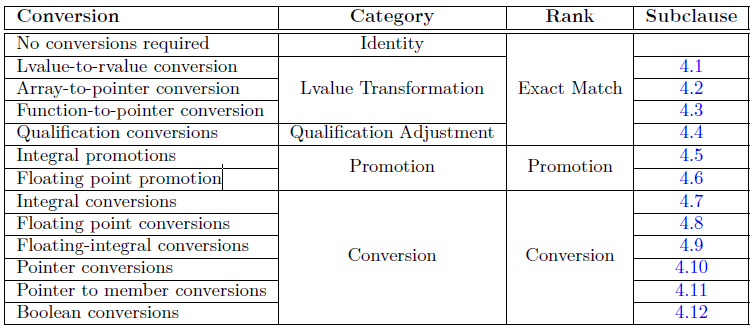

# 오버로딩 해석
## 개요
- 오버로딩 해석(Overload Resolution) : 호출 표현식에 대해서 호출할 대상을 선택하는 과정.
```c++
// OR_01.cpp
void DisplayNum( int ) { cout << "void DisplayNum( int )" << endl; }
void DisplayNum( double ) { cout << "void DisplayNum( double )" << endl; }

int main( )
{
	DisplayNum( 1 );
	DisplayNum( 1.0 );
}
```
## 오버로딩 시점
- 오버로딩 해석은 함수 호출 처리의 일부분이지만 아래와 같은 함수 호출에는 사용되지 않는다.

    > 함수 포인터, 멤버 함수 포인터를 통한 호출
	
    > 함수 유사 매크로
- 오버로딩 해석이 필요한 함수 호출은 다음과 같은 단계를 거쳐 호출된다.
    1. 이름을 룩업하여 초기 오버로딩 집합을 형성
    2. 템플릿 추론 등의 여러 가지 방법으로 집합을 재조정
    3. 후보 함수가 호출에 적합하지 않으면 오버로딩 집합에서 삭제하여 가용 함수 후보( viable function candidate )를 형성
    4. 가용 함수 후보 중 가장 잘 맞는 후보를 선택, 후보가 여러개 있다면 모호한 호출이 된다.
    5. 선택된 후보를 검사한다. ex) private 멤버라면 진단 메시지가 출력.
```c++
// OR_02.cpp
void Ambiguous(long) {}
void Ambiguous(double) {}

int main()
{
    Ambiguous(1); // error 후보가 여러개 있어 모호한 호출
}
```

## 가용 함수의 정렬 방법
- 오버로딩 해석은 호출의 각 인자와 가용 함수 후보들의 파라미터 간 대응 정도에 따라 순위를 매긴다.
- 한 후보가 다른 후보보다 더 낫다고 판단되려면 모든 파라미터가 다른 후보들의 파라미터보다 덜 일치해서는 안 된다.
```c++
// OR_03.cpp
void Combine( int, double ) {}
void Combine( double, int ) {}

int main()
{
	Combine( 1, 2 ); // error C2666: 'Combine': 2개 오버로드에 비슷한 변환이 있습니다.
}
```

- 가용 후보의 파라미터가 주어진 인자에 대해서 얼마나 잘 일치하는지 아래와 같은 순서로 순위를 매길 수 있다.

1위 - **완벽한 일치** : 파라미터가 주어진 인자의 데이터형을 갖거나 참조자의 데이터형을 갖는 경우. ( const, volatile 한정자가 추가되었을 수 있다. )
```c++
// OR_04.cpp
void PerfectMatch( const int ) { cout << "PerfectMatch( const int )" << endl; } // #1
void PerfectMatch( double ) { cout << "PerfectMatch( double )" << endl; } // #2

int main( )
{
	PerfectMatch( 1 ); // #1 이 호출
}
```

2위 - **작은 수정을 통한 일치** : 배열을 첫 번째 요소에 대한 포인터로 변환시키거나 int\*\*의 인자를 int const\* const\*의 파라미터로 일치시키기 위해 const를 포함하여 호출.
```c++
// OR_05.cpp
void MinorAdjust( int* pArray ) { cout << "#1" << endl; } // #1
// void MinorAdjust( int** ptr ) { cout << "#2" << endl; } // #2
void MinorAdjust( int const* const* ptr ) { cout << "#3" << endl; } // #3

int main()
{
	int arr[5] = {};
	MinorAdjust( arr ); // 배열을 포인터로 변환 ( decay )

	int* pArr = arr;
	int** ppArr = &pArr;
	MinorAdjust( ppArr ); // #2의 주석을 풀면 완벽한 일치로 #2
                          // #2가 없으면 int** -> int const* const*로 수정하여 #3 호출
}
```

3위 - **데이터형 승격을 통한 일치** : 작은 정수형( bool, char, short, 열거형 )을 int, unsigned int, long, unsigned long으로 float를 double로 묵시적으로 변환하여 호출.
```c++
// OR_06.cpp
void Promotion(char) { cout << "#1" << endl; } // #1
void Promotion(int) { cout << "#2" << endl; } // #2

int main()
{
	Promotion( true ); // bool -> int 데이터형 승격으로 #2 호출
}
```

4위 - **표준 변환만을 사용한 일치** : 표준변환을 통해서 호출 생성자를 묵시적으로 호출하는 것은 포함하지 않음.
> 표준 변환은 다음과 같은 변환이 포함. <br>
\> 정수형 간의 변환 ex) bool -> char <br>
\> 실수형 간의 변환 ex) float, double -> long double <br>
\> 정수형과 실수형 간의 변환 <br>
\> 정수형, 실수형, 포인터형을 bool로 변환 <br>
\> 정수 0을 null pointer로 변환 <br>
\> 자세한 내용은 [Implicit conversions](http://en.cppreference.com/w/cpp/language/implicit_conversion) 참조

```c++
// OR_07.cpp
void StandardConversion( char ) { cout << "#1" << endl; }
void StandardConversion( ... ) { cout << "#2" << endl; }

int main( )
{
	StandardConversion( true );
}
```

5위 - **사용자 정의 변환을 통한 일치** : 모든 종류의 묵시적 변환을 허용.
```c++
// OR_08.cpp
class Userdefined
{
public:
	Userdefined( int ) {}
};
void UserdefinedConversion( Userdefined ) { cout << "#1" << endl; }
void UserdefinedConversion( ... ) { cout << "#2" << endl; }

int main()
{
    UserdefinedConversion( 1 );
}
```

6위 - **생략을 통한 일치** : 생략된 파라미터는 거의 모든 데이터형에 일치한다. 다만 POD가 아닌 클래스형은 정의되지 않은 행동을 보인다.
```c++
// OR_09.cpp
void Ellipsis(...) { cout << "#1" << endl; }

int main()
{
    Ellipsis( 1 );
}
```
- 표로 아래와 같이 정리할 수 있다.

	
	
- 오버로딩 해석은 템플릿 인자 추론 이후에 일어나며 추론 자체는 어떤 종류의 변환으로도 간주하지 않는다.
```c++
//OR_10.cpp
template <typename T>
class Implicit
{
public:
	Implicit( T a ) { }
};

template <typename T>
void TemplateFunction( Implicit<T> ) {}

int main( )
{
	TemplateFunction<int>( 1 );	// ok
	TemplateFunction( 1 );		// error
}
```

## 멤버 함수를 위한 묵시적 인자(*this)에 관한 오버로딩 동작
- 정적이 아닌 멤버 함수의 호출은 멤버 함수 내에 숨겨진 파라미터 *this를 갖는다.
- 숨겨진 *this 파라미터는 명시적인 파라미터와 같이 오버로딩 해석에 참여하는데 정적 멤버를 비정적 멤버와 비교할 경우 묵시적인 *this 파라미터의 인자 일치 정도는 무시된다.
```c++
// OR_11.cpp
class BadString
{
public:
	BadString( char const* str ) 
	{
		int len = std::strlen( str );
		m_pString = new char[len + 1];
		memcpy_s( m_pString, len, str, len );
		m_pString[len] = '\0';
	}
	~BadString( )
	{
		delete m_pString;
	}

	char& operator[] ( size_t idx ) { return m_pString[idx]; }
	char const& operator[] ( size_t idx ) const { return m_pString[idx]; }

	operator char* () { return m_pString; }

private:
	char* m_pString = nullptr;
};

int main( )
{
	const BadString str1( "template" );
	str1[5];

	BadString str2( "study" );
	str2[5];	  // "[]" 연산자 중 두 개 이상이 이 피연산자와 일치합니다.
				  // 기본 제공 연산자 "pointer-to-obeject[interger]"
				  // 함수 "BadString::operator[](size_t)"
}
```
- 위의 코드에서 str[5]에 모호한 것이 없는 것처럼 보이나 묵시적 변환 연산자를 str에 적용하면 포인터형을 얻게 되고 내장 [] 연산자도 가용 후보가 된다.
- 내장 [] 연산자는 내포된 인자 *this에 관해서는 잘 일치하지 않지만 ptrdiff_t형이 int인 플랫폼에서 5라는 인자와 완전 일치한다.

> 위의 코드는 x86에서는 모호한 호출이지만 x64에서는 모호하지 않다.( ptrdiff_t형이 long이기 때문 )

## 완벽한 일치 상세
- int형의 인자와 완벽한 일치를 이루는 일반적인 파라미터형은 int, int&, int const& (const int&)가 있다.
- **lvalue의 경우에는 const가 없는 쪽**이 **rvalue의 경우에는 const가 있는 쪽**이 선호된다.
```c++
// OR_12.cpp
void PerfectMatch( int& ) { cout << "#1" << endl; } // #1
void PerfectMatch( const int & ) { cout << "#2" << endl; } // #2

int main()
{
	int k = 0;
	PerfectMatch( k ); // #1
	PerfectMatch( 42 ); // #2

	const int ck = 2017;
	PerfectMatch( ck ); // #2
}
```
- 멤버 함수 호출의 묵시적 인자에 대해서도 같은 법칙이 적용된다.
```c++
// OR_13.cpp
class Wonder
{
public:
	void tick() { cout << "#1" << endl; }
	void tick() const { cout << "#2" << endl; }
	void tack() const { cout << "#3" << endl; }
};

int main()
{
	Wonder device;
	device.tick(); // #1
	device.tack(); // #3 Wonder::tack 함수 중에 const가 아닌 함수가 없으므로
}
```
- 참조자가 있는 것과 없는 것에 대해 오버로딩한 경우 모호함이 발생할 수 있다.
```c++
// OR_12.cpp
void PerfectMatch( int ) { cout << "#3" << endl; } // #3 추가시 모호함 발생
``` 
## 비템플릿 선호
- 비템플릿 함수와 템플릿 함수의 특수화 결과가 동일하다면 비템플릿 함수가 선호된다.
```c++
// OR_14.cpp
template<typename T> int f( T ) { cout << "#1" << endl; }
void f( int ) { cout << "#2" << endl; }

int main()
{
	return f(7); // error 반환 값이 없는 비템플릿 함수가 선택.
}
```
## 변환순서
- 묵시적 변환시 기초 변환들이 차례대로 적용될 수 있다.
```c++
// OR_15.cpp
class Base
{
public:
	operator short() const { return 0; }
};

class Derived : public Base
{

};

void count( int ) {}

int main()
{
	Derived object;
	count( object ); // ok Derived -> Base -> short -> int 순으로 변환되어 잘 동작한다.
}
```
- 위 예제는 표준 변환 후 사용자 정의 변환이 뒤따르고 또다시 다른 표준 변환이 일어난다.
- 변환 과정중에는 사용자 정의 변환이 최대 한 번만 일어날 수 있다.
- 변환 과정중에 좀 더 적은 변환으로 호출가능한 함수가 있다면 해당 함수가 선호된다.
```c++
void count(short); // int로의 데이터 승격을 하지 않아도 되므로 더 선호된다.
```
## 포인트 변환
- 포인트 변환은 다음과 같은 특수 표준 데이터형 변환을 거친다.
1. 상속 관계의 클래스 포인터일 경우 상속받은 클래스에서 기본 클래스로의 변환
2. 멤버에 대한 포인터일 경우 기본 클래스에서 상속받은 클래스로의 변환
3. void* 형으로 변환
4. bool 형으로 변환
```c++
// OR_16.cpp
void check( void* ) { cout << "#1" << endl; } // #1
void check( bool ) { cout << "#2" << endl; } // #2

int main()
{
	int* p = nullptr;
	check(p); // #1 
			  // bool 형으로의 변환은 다른 표준 데이터형 변환보다 좋지 않은 것으로 취급.
}
```
- 상속 관계의 클래스 포인터일 경우 상속에 의한 관계가 있는 다른 클래스로의 변환이 존재하면 가장 하위의 상속 클래스로의 변환이 선호된다.
```c++
// OR_18.cpp
class Interface {};

class CommonProcesses : public Interface {};

class Machine : public CommonProcesses {};

void serialize( Interface* ) { cout << "#1" << endl; } // #1
void serialize( CommonProcesses* ) { cout << "#2" << endl; } // #2
void serialize( void* ) { std::cout << "#3" << std::endl; } // #3

int main()
{
	Machine* machine = nullptr;
	serialize( machine ); // #2 상속 관계의 포인터로의 변환이 void*로의 변환 보다 선호된다.
}
```
- ~~매우 비슷한 법칙이 멤버에 대한 포인터에도 적용된다. 멤버에 관한 포인터는 상속 그래프에서 **기본 클래스에 가장 가까운 클래스(상위 클래스)**가 선호된다.~~
> OR_19.cpp 를 보면 멤버 함수, 멤버 변수 포인터에 대해서 정상적으로 컴파일되지 않는다.

## functor와 대리함수
- 호출 표현식이 함수 대신 클래스형 객체를 참조한다면 오버로딩 집합에 두 가지가 더 추가될 수 있다.
1. 멤버 연산자 operator()
2. 포인터나 참조자를 함수형으로 묵시적 형변환하는 연산자
```c++
// OR_20.cpp
using FuncType = void(*)( double, int );

class IndirectFunctor
{
public:
	void operator()( double, double ) const {}
	operator FuncType() const { return nullptr; }
};

int main( )
{
	IndirectFunctor functor;
	functor( 3, 5 ); // error 모호한 호출 operator()는 묵시적인 *this 파라미터에 대해서는 잘 맞지만 두번째 인자가 FuncType보다 잘 맞지 않으므로 우열을 가릴 수 없다.
}
```
## 그 밖의 오버로딩 문맥
- 함수 호출 외에도 함수 호출과 유사한 선택을 해야 하는 상황이 존재한다.
- 함수의 주소가 필요할 경우
```c++
// OR_21.cpp
void n_elements( int ) { cout << "#1" << endl; }
void n_elements( float ) { cout << "#2" << endl; }

int main( )
{
	void ( *pFunc )(float) = n_elements;
	pFunc( 1 ); // #2
}
```
- 초기화시 적절한 생성자나 변환 연산자를 선택할 경우
```c++
// OR_22.cpp
class BigNum
{
public:
	BigNum( int ) { cout << "#1" << endl; }
	BigNum( long ) { cout << "#2" << endl; }
	BigNum( double ) { cout << "#3" << endl; }
	BigNum( const std::string& ) { cout << "#4" << endl; }

	operator double( ) { cout << "#5" << endl; return 1; }
	operator long( ) { cout << "#6" << endl; return 1.0; }
};

int main( )
{
	BigNum bn1( 100103 ); // #1
	BigNum bn2( "7057103224.095764" ); // #4
	int in = bn1; // #6
}
```
