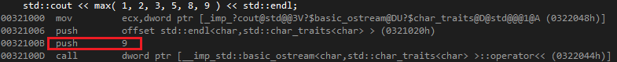

# 앞으로 나아갈 방향
## 개요
- C++ 템플릿이 처음 설계되기 시작한 이래 템플릿 영역에 대한 다양한 요구가 새로 등장하였다.
- 여기서는 한 번 이상 언급되었던 일부 확장에 대해 알아본다. 몇몇은 표준으로 제공됐고 몇몇은 아직도 제공되고 있지 않은 것도 있다.

## 꺾쇠 해킹
- 템플릿 프로그래밍을 하면서 두 개 이상의 꺾쇠를 사용할 때에는 공백을 삽입해야 한다.
```c++
// FD_01.cpp
#include <list>
#include <vector>

typedef std::vector<std::list<int> > LineTable;
typedef std::vector<std::list<int>> OtherTable;	// C++11 이전에서는 error
```
- 두 번째 typedef 선언에는 두 꺾쇠가 곧바로 이어져 있으므로 오른쪽 이동 (\>\>) 연산자로 인식되어 오류가 발생한다.
- 이런 오류를 검출하고 >> 연산자를 닫는 꺾쇠 두 개로 이해하는 것이 꺾쇠 해킹이다.
- **C++11 부터는 OtherTable 선언이 유효하다.** ([참고](https://en.wikipedia.org/wiki/C%2B%2B11#Right_angle_bracket))
- 다만 꺾쇠 해킹에는 몇 가지 미묘한 사항이 있는데 아래의 경우 \>\> 연산자가 유효한 토큰인 상황도 존재한다.
```c++
// FD_01.cpp
template <int N> class Buf;

template <typename T> void strange( ) {}
template <int N> void strange( ) {}

strange<Buf<16>>2>>( ); // >> 토큰은 오류가 아니지만 error
```
- 이와 연관된 다른 예로는 대괄호 [ 와 똑같이 사용되는 겹자인 <:를 들 수 있다.
```c++
// FD_01.cpp
class Marker;

std::list<::Marker>* marker; // -std=c++11 이상 옵션을 줬을 때만 ok
```
- std::list\<::Marker\>는 컴파일러가 보기에 std::list[:Marker\>가 되며 당연히 문법에 맞지 않는다. g++ 에서 -std=c++11 이상의 옵션에서 정상적으로 빌드됐다.

## 기본 함수 템플릿 인자
- C++에 *템플릿이 처음 추가됐을 때 명시적인 함수 템플릿 인자는 유효하지 않았다.* 함수 템플릿 인자는 항상 호출 표현식에서 추론돼야 했다. 기본 함수 템플릿의 인자가 항상 추론된 값으로 덮어씌워지므로 기본 함수 템플릿 인자를 허용할 이유가 없었다.
- 그러나 그 후 추론될 수 없는 인자에 대해 **명시적으로 함수 템플릿 인자를 표현하는 것이 가능해짐에 따라 자연스럽게 추론될 수 없는 템플릿 인자에 대한 기본값을 명시하는 일이 필요**해졌다.
```c++
// FD_02.cpp
template <typename T1, typename T2 = int>
T2 count( const T1& x ) 
{
	return x.size();
}

int i = count( v );
```
- 위 코드에서는 템플릿 파라미터가 기본 인자 값을 가진다면 그 이후의 각 파라미터는 역시 기본 템플릿 인자를 가져야만 한다는 제약 조건을 지켰다.
- 이런 제약 조건은 클래스 템플릿에서도 필요하다. 그렇지 않으면 생략된 인자 뒤에 따라오는 인자가 몇 번째 인자인지 알릴 방도가 없다.
```c++
// FD_02.cpp
template <typename T1 = int, typename T2>
class Bad{};

Bad<int>* b; // 주어진 int가 어떤 인자에 대한 치환인지 알 수 없다.
```
- 하지만 함수 템플릿에서 연이어 나오는 인자들은 추론될 수 있다. 그래서 다음과 같이 작성하는데 아무런 기술적 어려움이 없다.
```c++
template <typename T1 = int, typename T2>
T1 count2( const T2& x )
{
	return x.size( );
}

i = count2( v );
i = count2<int>( v );
```
- C++11에서 부터 함수 템플릿에서도 기본 템플릿 인자를 사용할 수 있게 되었고 위 예제 코드는 visual studio 2015, g++ -std=c++11 이상의 옵션에서 정상적으로 빌드됐다.

## 문자열 리터럴과 부동소수점 템플릿 인자
- 데이터형이 아닌 템플릿 인자에는 문자열 리터럴를 사용할 수 없다.
```c++
// FD_03.cpp
template <const char* msg>
class Diagnoser
{
public:
	void print( ) {}
};

int main( )
{
	Diagnoser<"Surprise!">( ).print( );
}
```
- 표준 C++에서 Diagnoser의 두 인스턴스는 같은 인자를 가질 경우 같은 데이터형을 가진다. 그러나 위의 코드의 인자는 포인터 값이다. **같은 두 문자열 리터럴이 다른 소스코드 위치에 있다면 같은 주소를 갖지 않을 것이다. 따라서 Diagnoser\<"X"\>와 Diagnoser\<"X"\>가 서로 다르고 비교할 수 없는 데이터형이 된다.**
- 이런 이상한 상황으로 인해서 C++ 표준에서는 템플릿의 인자로 문자열 리터럴을 사용할 수 없다.
- 부동소수점 리터럴 또한 템플릿 인자로 사용할 수 없다.
```c++
// FD_03.cpp
template <double Ratio>
class Converter
{
public:
	static double convert( double val )
	{
		return val * Ratio;
	}
};

typedef Converter<0.0254> InchToMeter;
```
- 부동소수점 리터럴은 문자열 리터럴과는 달리 심각한 기술적 문제는 없다.

## 템플릿 템플릿 파라미터의 일치 완화
- 템플릿 템플릿 파라미터 치환에 사용되는 템플릿은 템플릿 파라미터의 파라미터 목록에 정확하게 일치해야 한다.
```c++
// FD_04.cpp
#include <list>

template <typename T1, typename T2, template <typename> class Container>
class Relation
{
private:
	Container<T1> dom1;
	Container<T2> dom2;
};

int main( )
{
	Relation<int, double, std::list> rel;
}
```
- 위 코드는 **템플릿 템플릿 파라미터인 Container가 파라미터 하나를 받는 템플릿을 기대하는데 반해 std::list는 요소형을 결정하는 파라미터 외에도 할당자 파라미터를 받으므로 오류가 발생**한다.
- 하지만 std::list는 할당자 파라미터에 대한 기본 템플릿 인자를 가지므로 Container가 std::list와 일치되게 명시할 수 있으며 Container의 각 인스턴스는 std::list의 기본 템플릿 인자를 사용할 수 있을 것이다.

## typedef 템플릿
- 클래스 템플릿은 다른 파라미터화된 데이터형을 얻기 위해 상당히 복잡한 방식으로 결합되는 경우가 자주 발생한다. 파라미터화된 데이터형이 소스코드에서 자주 등장한다면 typedef로 파라미터화되지 않는 데이터형에 대한 별칭을 붙이는 것 처럼 파라미터화된 데이터형에도 별칭을 붙이고 싶을 것이다.
- typedef 템플릿은 C++11 에서 using을 통해 제공되었다.
```c++
// FD_05.cpp
#include <list>
#include <vector>

template <typename T>
using Table = std::vector<std::list<T>>;
```
- 이런 선언 후 Table은 실제 데이터형 선언이 될 수 있는 인스턴스화를 제공하는 새로운 템플릿이 된다.
```c++
// FD_05.cpp
Table<int> t;
```
- using 을 지원하지 않던 이전 C++ 버전에서는 클래스 템플릿 멤버에 typedef를 사용해서 이와 유사한 기법을 사용하였다.
```c++
// FD_05.cpp
template <typename T>
class CTable
{
public:
	typedef std::vector<std::list<T>> Type;
};

CTable<int>::Type ct;
```
- 하지만 using은 명시적으로 특수화될 수 없다.
```c++
// FD_05.cpp
template <typename T> using Opaque = T;
template <typename T> using Opaque<T*> = void*;
template <> using Opaque<void> = bool;
```
- 마지막으로 함수 템플릿와 using을 사용할 경우 템플린 인자 추론의 예를 살펴보자
```c++
// FD_05.cpp
void candidate( long ) { std::cout << "#1" << std::endl; }
template <typename T> using DT = T;
template <typename T> void candidate( DT<T> ) { std::cout << "#2" << std::endl; }

candidate( 42 ); // 인자가 int형으므로 candidate의 T가 int로 치환되고 DT<T>가 다시 int로 치환되어 완벽하게 매칭되는 함수가 인스턴스화되므로 #2가 호출된다.
```

## 함수 템플릿의 부분 특수화
- 함수 템플릿의 오버로딩과는 다르게 부분 특수화는 새로운 템플릿을 도입하지 않는다. *부분 특수화는 현존하는 템플릿에 대한 확장*이다.
- 클래스 템플릿을 룩업할 때는 가장 먼저 기본 템플릿을 고려한다. 기본 템플릿이 선택된다면 그 후에 해당 템플릿의 부분 특수화들을 살펴보면서 현재 인스턴스에 적절한 템플릿 인자 패턴을 가지는 것이 있다면 기본 템플릿 정의 대신 해당 정의를 인스턴스화한다.
> 전체 템플릿 특수화도 같은 방식으로 동작한다.

- 반면 오버로딩된 함수 템플릿은 서로 완전히 분리된 독립적인 템플릿이다. 어떤 템플릿을 인스턴스화할지 선택하기 위해서 오버로딩된 모든 템플릿이 함께 고려되며 오버로딩 해석 법칙에 가장 잘 맞는 것이 선택된다.
- 오버로딩 방식이 더 적절한 방식이라고 느낄 수 있지만 이 방법에는 몇 가지 제약사항이 있다.

1\. 특수화를 사용하면 클래스의 정의를 바꾸지 않고도 클래스의 멤버 템플릿을 특수화 할 수 있다. 하지만 오버로딩된 멤버를 추가하려면 클래스의 정의가 수정돼야 한다.

2\. 오버로딩되지 않은 함수에서는 유효했던 코드가 함수가 오버로딩된 후에는 유효하지 않을 수 있다.

3\. 프렌드 선언은 특정 함수 템플릿이나 특정 함수 템플릿의 인스턴스를 참조한다. 함수 템플릿의 오버로딩된 버전은 기본 템플릿의 권한을 자동적으로 물려받지 않는다.

- 부분적으로 특수화된 템플릿을 위한 자연스러운 문법은 클래스 템플릿 표기의 일반화이다.
```c++
// FD_06.cpp
template <typename T>
const T& max( const T&, const T& ) {} // 기본 템플릿

template <typename T>
const T*& max<T*>( const T*&, const T*& ) {} // 부분 특수화 : 동작하는 코드는 아님
```

## typeof 연산자
- 템플릿을 작성할 때 템플릿 종속 표현식의 데이터형을 표현할 수 있다면 매우 유용할 것이다.
- 아래와 같은 코드를 생각해보자.
```c++
// FD_07.cpp
template <typename T1, typename T2>
std::array<???, 10> operator+( const std::array<T1, 10>& lhs, const std::array<T2, 10>& rhs ) {}
```
- 이 연산자는 배열의 원소를 더한 결과로 이뤄진 배열을 생성할 것이다. 결과 요소의 데이터형은 x[0] + y[0]의 데이터형이다. 문제는 **T1, T2라는 용어만으로 이런 결과 데이터형을 믿을 만하게 표현하는 방식을 제공하지 않는 점이다.**
- 이런 현상은 C++11에서 부터 추가된 decltype을 사용하여 해결할 수 있다.
```c++
// FD_07.cpp
template <typename T1, typename T2>
std::array<decltype(T1() + T2()), 10> operator+( const std::array<T1, 10>& lhs, const std::array<T2, 10>& rhs ) 
{
	std::array<decltype( T1() + T2() ), 10> result;
	return result;
}
```
- operator+ 함수의 인자 lhs와 rhs를 통해서 반환형을 추론하고 싶다면 다음과 같이 반환형을 파라미터형 뒤에 위치시키는 방법을 사용할 수 있다.
```c++
// FD_07.cpp
template <typename T1, typename T2>
auto operator+( const std::array<T1, 10>& lhs, const std::array<T2, 10>& rhs ) -> std::array<decltype( lhs[0] + rhs[0] ), 10> 
{
	std::array<decltype( lhs[0] + rhs[0] ), 10> result;
	return result;
}
```
- decltype은 컴파일 시 연산자이다. 특히 decltype은 공변 반환형을 고려하지 않는다.
```c++
// FD_07.cpp
class Base
{
public:
	virtual Base* clone( );
};

class Derived : public Base
{
public:
	virtual Derived* clone( ); // 공변 반환형
};

void demo( Base* p, Base* q )
{
	decltype( p->clone( ) ) tmp = p->clone( ); // tmp는 항상 Base* 형을 가짐
}
```

## 정적 속성
- C++11에서 부터 추가된 type_traits 헤더를 통해서 컴파일 시에 데이터형을 분류할 수 있다.
```c++
// FD_08.cpp
#include <iostream>
#include <type_traits>

int main( )
{
	std::cout << std::is_copy_assignable<int>::value << std::endl;
	std::cout << std::is_union<int>( ) << std::endl;
}
```
- 데이터형의 정적 속성을 통해 템플릿의 특수화를 선택할 때 이런 특질(trait)이 유용하게 사용된다.
- type_traits가 제공하는 기능은 [이곳](http://en.cppreference.com/w/cpp/header/type_traits)에서 확인할 수 있다.

## 맞춤형 인스턴스화 진단
- 많은 템플릿은 자신의 파라미터에 묵시적인 요구사항을 둔다. 이런 템플릿의 인스턴스에 대한 인자가 이런 요구사항을 만족시키지 못하면 일반적인 오류가 발생하거나 생성된 인스턴스가 제대로 동작하지 않을 것이다.
- 초기 C++ 컴파일러는 템플릿 인스턴스에 대한 일반적인 오류를 해독하는 것이 매우 힘들었다. 최신 컴파일러에서는 숙련된 프로그래머라면 문제를 빠르게 추적할 수 있을 만큼 충분히 쉬워졌으나 여전히 이런 상황을 개선하려는 요구는 지속적으로 존재해 왔다. 아래 코드를 살펴보자.
```c++
// FD_09.cpp
template <typename T>
void clear( const T& p )
{
	*p = 0; // T가 포인터와 유사한 데이터형을 가진다고 가정했다.
}

template <typename T>
void core( const T& p )
{
	clear( p );
}

template <typename T>
void middle( typename T::Index p )
{
	core( p );
}

template <typename T>
void shell( const T& env )
{
	typename T::Index i;
	middle<T>( i );
}

class Client
{
public:
	typedef int Index;
};

int main( )
{
	Client main_client;
	shell( main_client );
}
```
- clear 함수가 포인터와 유사한 데이터형을 가진다고 가정하였으므로 shell 함수의 인스턴스화 결과의 깊은 곳에서 에러가 발생한다.
- 08\_Using\_Template\_in\_Practice 에서도 살펴보았듯이 얕은 인스턴스화를 통해서 조기에 에러를 발생시키는 방법도 있지만 C++11에서 부터 추가된 static_assert를 사용해서 정적 시간에 타입을 검사하여 오류를 발생할 시킬 수도 있다.
```c++
// FD_09.cpp
namespace detail {
	template <typename T> auto test( T* val ) -> decltype( *(*val) );
	struct two { char c[2]; };
	template <typename T> two test( ... );
}

template <class T>
struct has_dereference_operator : std::integral_constant<bool, !std::is_same<decltype( detail::test<T>( nullptr ) ), detail::two>::value> {};


template <typename T>
void shell( const T& env )
{
	typename T::Index i = 0;
	static_assert( has_dereference_operator<T::Index>::value, "illigal type" ); // 역참조 불가능한 자료형이면 compile time error
	middle<T>( i );
}
```
- 이런 접근 방식에도 단점이 있는데 데이터형의 모든 속성을 설명하다 보면 코드가 거추장스럽게 될 수 있다.

## 클래스 템플릿 오버로딩
- 클래스 템플릿을 템플릿 파라미터에 따라 오버로딩하는 것을 생각해보자 아래와 같은 코드를 작성할 수 있을 것이다.
```c++
// FD_10.cpp
template <typename T1>
class Tuple
{
	// ...
};

template <typename T1, typename T2>
class Tuple
{
	// ...
};

template <typename T1, typename T2, typename T3>
class Tuple
{
	// ...
};
```
- 오버로딩이 템플릿 파라미터의 갯수에만 국한될 필요는 없다. 오버로딩 시 파라미터의 종류도 바꾸는 것도 생각해 볼 수 있다.
```c++
// FD_10a.cpp
template <typename T1, typename T2>
class Pair
{
	// ...
};

template <int T1, int T2>
class Pair
{
	// ...
};
```
- 이런 생각이 언어 설계자 사이에서 비공식적으로 논의되긴 했지만 아직까지는 C++ 표준에서 지원하지 않는다.

## 목록 파라미터
- 단 하나의 템플릿 인자로 데이터형의 목록을 전달하는 기능이 필요할 때가 있다. 이런 목록은 다음 둘 둥 하나를 위해 쓰인다.

1\. 파라미터화된 파라미터의 개수를 가지는 함수를 선언하기 위해서

2\. 파라미터화된 멤버 목록으로 타입 구조체를 정의하기 위해서

- 목록 파라미터는 C++11부터 가변 인자 템플릿( variadic template )이란 이름으로 표준에 도입되었다.
```c++
// FD_11.cpp
#include <iostream>

template <typename T, typename... U>
const T& max( const T& first, const T& second, const U&... remain )
{
	return max( max( first, second ), remain... );
}

template <typename T>
const T& max( const T& first, const T& second )
{
	return first > second ? first : second;
}

int main( )
{
	std::cout << max( 1, 2, 3, 5, 8, 9 ) << std::endl;
}
```
- max( 1, 2, 3, 5, 8, 9 )를 호출할 경우 어떻게 함수가 호출되는지 살펴보자.
- 우선 인자가 6개이므로 인자 두개를 받는 max는 맞지 않지만 가변 인자 템플릿을 사용하는 함수는 T를 int로 U를 int로 치환할 경우 일치한다. 이 경우 첫번째와 두번째 인자 1, 2로 재귀적으로 max 함수를 호출하고 남은 인자를 사용하여 max를 호출하는 과정을 거친다.
- 이 작업은 함수 템플릿 오버로딩의 능력에 기대어 잘 동작한다. 함수를 재귀 호출하는 동작방식으로 성능이 신경 쓰일 수 있는데 실제로 어셈블리를 살펴보면 최적화가 잘 일어나는 것을 볼 수 있다.

	

- 파라미터 리스트의 요소의 수를 세고 싶을 수 도 있다. 이 경우에는 C++11에서 추가된 sizeof... 연산자를 사용할 수 있다.
```c++
// FD_11.cpp
template <typename... T>
int countArg( const T&... args )
{
	return sizeof...(args);
}

std::cout << ( 1, 2, 3, 4, 5, 6, 7, 8, 9, 10 ) << std::endl;
```

## 레이아웃 제어
- 아래와 같은 구조로 공용체를 만들다고 가정하자.
```c++
// FD_12.cpp
class D_Union
{
public:
	enum { n_bytes };
	char bytes[n_bytes];
};
```
- 만약 T가 byte 버퍼보다 **엄격한 정렬요건을 가질 수 있으므로 상수 n_bytes가 항상 sizeof(T)로 설정될 수 있는 건 아니다.**
- 따라서 데이터형의 정렬 조건을 상수 표현식으로 표현할 수 있는 기능과 반대로 데이터형 필드 혹은 변수에 할당하는 기능이 필요하다.
- C++11 에서 추가된 alignof 연산자를 통해서 데이터형이 몇 바이트 단위로 정렬돼 있는지를 알 수 있다.
- 이를 통해서 아래와 같이 가변 인자 템플릿을 사용하여 가장 큰 정렬의 크기를 결정할 수 있다.
```c++
// FD_12.cpp
template <typename T, typename... U>
class Alignment
{
public:
	enum { max = ( alignof( T ) > Alignment<U...>::max ) ? alignof( T ) : Alignment<U...>::max };
};

template <typename T>
class Alignment<T>
{
public:
	enum { max = alignof( T ) };
};

struct PerfectFit
{
	char a;
	short b;
	bool d;
};

struct Pedding
{
	char a;
	double c;
};

int main( )
{
	std::cout << Alignment<PerfectFit, Pedding>::max << std::endl;
}
```

## 초기화 추론
- 다음과 같은 자료형의 선언을 살펴보자
```c++
// FD_13.cpp
std::map<std::string, std::list<int>>* dict = new std::map<std::string, std::list<int>>;
```
- 이 코드는 하나의 map 객체를 할당하려고 했을 뿐이지만 매우 길다.
- 이런 선언에는 자료형이 중복되어 나타나는 것을 볼 수 있는데 사실 그 자료형은 자신의 초기값 할당 명령에서 생성된 자료형에 의해 묵시적으로 표기되어 있다.
- C++11 에서는 새롭게 추가된 auto 키워드를 통해서 초기값을 통해서 자료형을 추론할 수 있다.
```c++
// FD_13.cpp
auto auto_dict = new std::map<std::string, std::list<int>>;
```
- auto의 추론 방식은 템플릿 인자의 추론 방식과 유사하며 중괄호 초기화가 initialize_list를 나타낸다고 가정한다는 점만 다르다.
```c++
// FD_13.cpp
auto a = { 1, 2, 3, 4 };	// initialize_list

auto b{ 1 };				// int
```

## 함수 표현식
- 표준 백터의 각 요소에 대해 특정 멤버 함수를 호출해 초기화하려고 한다고 해보자.
```c++
// FD_14.cpp
class BigValue
{
public:
	void init( )
	{
		std::cout << "init" << std::endl;
	}
};

class Init
{
public:
	void operator()( BigValue& v ) const
	{
		v.init( );
	}
};

int main()
{
	std::vector<BigValue> vec;
	vec.emplace_back( );
	vec.emplace_back( );
	vec.emplace_back( );

	std::for_each( vec.begin( ), vec.end( ), Init() );
}
```
- 이를 위해서 Init이라는 클래스를 선언해야 하는 불편함이 있다. 대신 표현식의 일부로 함수를 작성해볼 수 있다. C++11에서는 람다 표현식을 통해서 이름 없는 함수를 표현식의 일부로 작성할 수 있다.
```c++
// FD_14.cpp
std::for_each( vec.begin( ), vec.end( ), []( BigValue& v ) { v.init( ); } );
```