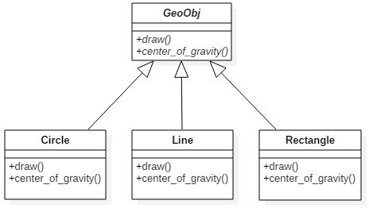
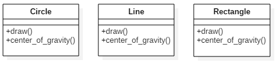
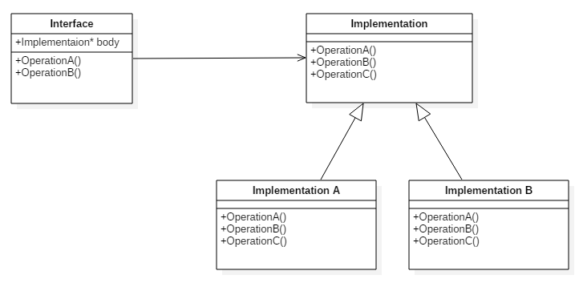
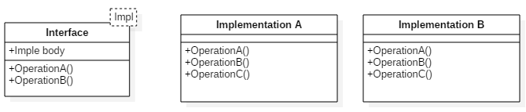

# 템플릿의 다형성 능력
## 개요
- 다형성(polymorphism)은 하나의 일반 표기법을 통해 다양하고 구체적인 행위를 연결하는 능력이다.
- 다형성은 객체지향 프로그래밍 패러다임의 주춧돌로 C++에서 클래스 상속과 가상 함수를 통해 지원되고 있다.
- 이런 메커니즘은 실행시간에 처리되므로 **동적 다형성**이라고 부르고 C++에서 평범한 다형성에 대해 말한다면 그것은 동적 다형성을 지칭하는 것이다.
- 템플릿 역시 단 하나의 일반 표기법을 통해 다양하고 구체적인 행위를 연관 지을 수 있으며 이런 연결이 일반적으로 컴파일 시간에 결정되므로 **정적 다형성**이라고 부른다.

## 동적 다형성
- C++은 가상 함수와 함께 상속을 통해서 다형성을 지원한다. 이 관점에서 다형성 설계는 관련된 객체형 사이에서 공통된 기능을 식별하고 공통 기본 클래스에 가상 함수 인터페이스를 선언하여 이뤄진다.
- 추상 기본 클래스( ABC, abstract base class )를 통해 객체들에 적용될 공통 연산과 특성을 선언한 예제를 살펴보자.

	

```c++
// TPPT_01.cpp
class GeoObj
{
public:
	virtual void draw( ) const = 0;
	virtual Coord center_of_gravity( ) const = 0;
};

class Circle : public GeoObj
{
public:
	virtual void draw( ) const;
	virtual Coord center_of_gravity( ) const;
};

class Line : public GeoObj
{
public:
	virtual void draw( ) const;
	virtual Coord center_of_gravity( ) const;
};
```
- 실제 객체를 생성한 후 클라이언트 코드는 기본 클래스에 대한 참조자나 포인터를 통해 객체를 조작하는데 가상 함수 메커니즘이 있기에 기본 클래스에 대한 참조자나 포인터를 써도 실제 객체가 조작된다. 위 예제 코드의 객체를 실제로 사용하는 코드는 다음과 같이 작성할 수 있다.
```c++
// TPPT_01.cpp
void myDraw( const GeoObj& obj )
{
	obj.draw( );
}

Coord distance( const GeoObj& x1, const GeoObj& x2 )
{
	Coord c = x1.center_of_gravity( ) - x2.center_of_gravity( );
	return c.abs( );
}

void drawElems( const std::vector<GeoObj*>& elems )
{
	for ( size_t i = 0; i < elems.size( ); ++i )
	{
		elems[i]->draw( );
	}
}

int main( )
{
	Line l;
	Circle c, c1, c2;

	myDraw( l );
	myDraw( c );

	distance( c1, c2 );
	distance( l, c );

	std::vector<GeoObj*> coll;

	coll.push_back( &l );
	coll.push_back( &c );

	drawElems( coll );
}
```
- 공통적인 추상 클래스를 사용하므로 어떤 멤버 함수가 호출돼야 할지 컴파일 시에 결정할 수 없다. 하지만 실행 시간에 함수를 호출하여 어떤 가상 함수가 호출돼야 하는지 객체의 동적 정보를 얻을 수 있다.
- 동적 다형성의 가장 매력적인 특징은 이종의 객체를 모아서 처리할 수 있는 능력으로 간단한 표현식을 통해서 배열 내 요소의 구체 클래스에 따른 여러 가지 멤버 함수를 호출할 수 있다.

## 정적 다형성
- 템플릿도 다형성을 구현하는 데 사용되 수 있지만 기본 클래스의 공통 행위에 기반을 둔 다형성은 아니다. 다만 공통 문법을 사용해 연산을 지원해야 한다는 묵시적 공통점을 갖는다.
> 즉 관련 함수들은 반드시 같은 이름을 사용해야 한다.

- 구체 클래스는 서로 독립적으로 정의하며 다형성 능력은 템플릿이 구체 클래스로 인스턴스화될 때 나타난다.

	

- 예를 들어 이전 예제의 myDraw() 함수는 다음과 같이 바꿀 수 있다.
```c++
// TPPT_02.cpp
template <typename GeoObj>
void myDraw( const GeoObj& obj )
{
	obj.draw( );
}
```
- 동적 다형성을 이용한 myDraw() 함수와 가장 큰 차이점은 GeoObj가 공통 기본 클래스가 아니라 템플릿 파라미터라는 점이며 동적 다형성은 실행 시간에 단 하나의 myDraw() 함수를 가지지만 템플릿에서는 myDraw\<Line\>이나 myDraw\<Circle\>과 같은 다양한 함수를 가진다.
- 동적 다형성을 이용한 예제를 정적 다형성을 사용하게 바꿔보면 도형 클래스의 계층 구조가 다양한 개별 도형 클래스로 바뀐다.
```c++
// TPPT_02.cpp
class Circle
{
public:
	void draw( ) const;
	Coord center_of_gravity( ) const;
};

class Line
{
public:
	void draw( ) const;
	Coord center_of_gravity( ) const;
};
```
- 개별 도형 클래스를 사용하는 코드는 다음과 같이 작성한다.
```c++
// TPPT_02.cpp
template <typename GeoObj>
void myDraw( const GeoObj& obj )
{
	obj.draw( );
}

template <typename GeoObj1, typename GeoObj2>
Coord distance( const GeoObj1& x1, const GeoObj2& x2 )
{
	Coord c = x1.center_of_gravity( ) - x2.center_of_gravity( );
	return c.abs( );
}

template <typename GeoObj>
void drawElems( const std::vector<GeoObj>& elems )
{
	for ( size_t i = 0; i < elems.size( ); ++i )
	{
		elems[i].draw( );
	}
}

int main( )
{
	Line l;
	Circle c, c1, c2;

	myDraw( l );
	myDraw( c );

	distance( c1, c2 );
	distance( l, c );

	std::vector<Line> coll;

	coll.push_back( l );

	drawElems( coll );
}
```
- 정적 다형성을 사용하면 이종의 객체를 쉽게 관리 할 수 없다. 여기서 정적 다형성의 정적인 부분의 한계가 드러난다. 모든 데이터형은 컴파일 시간에 결정돼야 한다.

## 동적 다형성과 정적 다형성 비교
### 용어
- 상속에 의해 구현되는 다형성은 한정되고 동적이다.
    - 한정된( bounded ) 이란 말은 다형적 동작에 참여하는 데이터형의 인터페이스가 공통 기반 클래스의 설계에서부터 미리 결정됐다는 뜻이다.
    > 다른 말로는 침입할 수 없다( invasive, intrusive )고 한다.

    - 동적이란 말은 실행 시간에 인터페이스에 바인딩이 결정된다는 뜻이다.

- 템플릿으로 구현된 다형성은 한정되지 않았으며 정적이다.
    - 한정되지 않은( unbounded ) 이란 말은 다형성 동작에 참여하는 데이터형의 인터페이스가 미리 정해지지 않았다는 뜻이다.
    > 다른 말로는 침입을 억제하지 않음( noninvasive, nonintrusive )이라고 한다.

    - 정적이란 말은 인터페이스 바인딩이 컴파일 시 결정된다는 뜻이다.

- C++ 전문 용어로 동적 다형성과 정적 다형성이란 한정된 동적 다형성과 한정되지 않은 정적 다형성의 줄임말이다.

### 장점과 약점
- C++에서 동적 다형성은 다음과 같은 장점을 가진다.
    - 여러 객체의 모둠을 처리할 수 있다.
    - 잠재적인 실행 코드 크기가 작다.
    - 코드가 완전히 컴파일될 수 있다. 그래서 소스 코드를 배포할 필요가 없다.

- 정적 다형성이 갖는 장점은 다음과 같다.
    - 내장 데이터형의 모둠이 쉽게 구현된다. 일반적으로 말하면 인스턴스 공통성이 공통 기반 클래스를 거쳐 표현될 필요가 없다.
    - 생성된 코드는 잠재적으로 더 빠르다.
    - 애플리케이션에서 일부만이 사용될 경우 부분 인터페이스만을 제공하는 실제 객체도 사용될 수 있다.

- 정적 다형성은 모든 바인딩을 컴파일 시에 검사하므로 동적 다형성에 비해 데이터형 안전성이 높다.

### 두 형태의 결합
- 두 종류의 다형성을 결합할 수 도 있다. 예를 들어 여러 도형 객체의 모둠을 처리하려면 다양한 도형 객체가 공통 기본 클래스에서 상속되는 쪽이 좋다. 하지만 특정 도형 객체에 대한 코드를 작성하기 위해 여전히 템플릿도 사용할 수 있다.

## 설계 패턴의 새로운 형태
- 정적 다형성이라는 새로운 형태가 등장하여 설계 패턴을 구현하는 데도 새로운 방식이 생겨났다. 예를 들어 bridge pattern을 생각해보자

	

- bridge pattern을 사용하는 이유 중 하나는 인터페이스의 다양한 구현들 사이를 오갈 수 있다는 점을 들 수 있다. 하지만 구현의 데이터형이 컴파일 시에 알려져 있다면 접근 방식을 템플릿으로 구현할 수 있을 것이다. 이것이 데이터형 안정성이 더 높고 포인터를 사용하지 않아도 되며 더 빠르다.

	

## 일반 프로그래밍
- 정적 다형성은 일반 프로그래밍이라는 개념을 지지한다. 하지만 일반 프로그래밍에 대한 정의는 전반적으로 합의되지 않았다.
- C++에서 일반 프로그래밍이란 템플릿을 이용한 프로그래밍을 일컫곤 한다. 이런 관점에서 C++ 템플릿을 사용하는 것만으로도 일반 프로그래밍을 사용하는 것처럼 느껴질 수 있다.
- 이제까지 이영역에서 가장 중요한 공헌을 한 것은 STL이다. STL에서 알고리즘은 일반적인 방식으로 작성돼 어떤 컨테이너에서도 사용될 수 있다. 그러기 위해 STL의 설계자들은 어떤 종류의 선형 모둠에서 제공될 수 있는 반복자(iterator)라는 추상 개념을 사용한다. 컨테이너 연산의 모둠별 특성은 반복자의 기능에 구현되어 있다.
- 그 결과 한 숫자 모둠에 값들이 어떻게 저장돼 있는지 모르더라도 최댓값을 계산하는 연산을 구현할 수 있다.
```c++
// TPPT_03.cpp
template <typename Iterator>
Iterator max_element( Iterator begin, Iterator end )
{
	Iterator max = begin;

	for ( Iterator i = ++begin; i != end; ++i )
	{
		if ( *max < *i )
		{
			max = i;
		}
	}

	return max;
}
```
- max_element() 와 같은 유용한 연산을 모든 선형 컨테이너마다 구현하지 않고 컨테이너가 자신이 가지고 있는 값들을 순차적으로 접근하는 반복자형과 이런 반복자를 생성하는 멤버 함수를 제공하기만 하면 어떤 모둠의 최댓값도 찾을 수 있다.
```c++
// TPPT_03.cpp
template <typename T, typename Iterator>
class list
{
public:
	typedef Iterator const_iterator;

	const_iterator begin( ) const;
	const_iterator end( ) const;
};
```
- STL을 사용한 예제를 살펴보면 아래와 같다.
```c++
// TPPT_04.cpp
#include <vector>
#include <list>
#include <algorithm>
#include <iostream>

template <typename T>
void print_max( const T& coll )
{
	typename T::const_iterator pos;

	pos = std::max_element( coll.begin( ), coll.end( ) );

	if ( pos != coll.end( ) )
	{
		std::cout << *pos << std::endl;
	}
	else
	{
		std::cout << "empty" << std::endl;
	}
}

int main( )
{
	std::vector<int> c1 = { 10, 9, 8, 20, 40, 9 };
	std::list<float> c2 = { 1.f, 1.f, 2.f, 3.f, 5.f, 8.f };

	print_max( c1 );
	print_max( c2 );
}
```
- 이렇게 반복자를 통해 연산을 파라미터화하여 연산에 대한 정의가 넘쳐나지 않게 막을 수 있다. 이제 모든 컨테이너에 대해 각 연산을 구현하는 대신 알고리즘을 한 번만 구현해도 모든 컨테이너에 적용할 수 있다.
- 이것은 바로 반복자가 컨테이너에서 제공하는 알고리즘에 사용되는 인터페이스를 가지기 때문이다. 이 인터페이스는 일반적으로 개념 ( concept )이라고 불리며 특정 템플릿이 이 프레임워크에 맞추기 위해서는 충족해야 하는 일련의 제약 조건을 가리킨다.