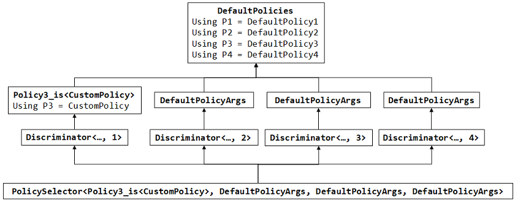
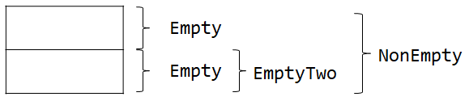

# 템플릿과 상속
## 개요
- 템플릿과 상속을 같이 사용하면 파라미터화된 상속이라는 흥미로운 기술을 사용할 수 있다. 여기서는 이 기술들을 알아본다.

## 이름 붙여진 템플릿 인자
- 때로는 템플릿이 많은 수의 다양한 파라미터를 가지는데 대부분은 합리적인 기본값을 가지고 있다. 이런 클래스 템플릿의 코드는 다음과 같이 작성될 것이다.
```c++
// TAI_01.cpp
template <typename Policy1 = DefaultPolicy1,
            typename Policy2 = DefaultPolicy2,
            typename Policy3 = DefaultPolicy3,
            typename Policy4 = DefaultPolicy4>
class BreadSlicer
{
    // ...
};
```

- 이 템플릿은 BreadSlicer\<\> 와 같은 형태로 사용하면 기본 템플릿 인자 값을 갖는 템플릿이 생성된다. 하지만 **기본이 아닌 인자를 명시하려면 인자 앞의 모든 인자도 함께 명시해야 한다.**
- 만약 BreadSlicer\<Policy3 = Custom\> 과 같이 생성하는 방법이 있다면 훨씬 편리할 것이다.
- 이 기술은 파생을 통해 파라미터를 덮어쓰는 방식이다. 데이터형 인자는 직접 명시하지 않고 도우미 클래스를 통해 명시한다.
> 예를 들어 BreadSlicer\<Policy3_is\<Custom\>\> 과 같은 문법으로 클래스 템플릿을 생성할 수 있다.

```c++
// TAI_01.cpp
// Discriminator는 같은 기본 클래스를 여러 개 가질 수 있도록 한다.
template <typename Base, int D>
class Discriminator : public Base
{
};

template <typename Setter1, typename Setter2,
		typename Setter3, typename Setter4>
class PolicySelector : public Discriminator<Setter1, 1>,
						public Discriminator<Setter2, 2>,
						public Discriminator<Setter3, 3>,
						public Discriminator<Setter4, 4>
{
};

// 기본 정책 클래스
class DefaultPolicy1 {};
class DefaultPolicy2 {};
class DefaultPolicy3 {};
class DefaultPolicy4 {};

// 기본 정책 이름을 P1, P2, P3, P4로 해서 한곳에 모은다.
class DefaultPolicies
{
public:
	using P1 = DefaultPolicy1;
	using P2 = DefaultPolicy2;
	using P3 = DefaultPolicy3;
	using P4 = DefaultPolicy4;
};

class DefaultPolicyArgs : virtual public DefaultPolicies
{
};

// 기본 정책 값을 덮어쓰는 템플릿을 정의한다.
template <typename Policy>
class Policy1_is : virtual public DefaultPolicies
{
public:
	using P1 = Policy;
};

template <typename Policy>
class Policy2_is : virtual public DefaultPolicies
{
public:
	using P2 = Policy;
};

template <typename Policy>
class Policy3_is : virtual public DefaultPolicies
{
public:
	using P3 = Policy;
};

template <typename Policy>
class Policy4_is : virtual public DefaultPolicies
{
public:
	using P4 = Policy;
};

// 각 템플릿 인자는 어떤 정책이라도 설명할 수 있으므로 기본값은 모두 같다.
template <typename PolicySetter1 = DefaultPolicyArgs,
		typename PolicySetter2 = DefaultPolicyArgs,
		typename PolicySetter3 = DefaultPolicyArgs,
		typename PolicySetter4 = DefaultPolicyArgs>
class BreadSlicer
{
public:
	using Policies = PolicySelector<PolicySetter1, PolicySetter2, PolicySetter3, PolicySetter4>;
};

class CustomPolicy {};

int main()
{
	BreadSlicer<> default;
	BreadSlicer<Policy3_is<CustomPolicy>> costumPolicy;

	std::is_same<typename BreadSlicer<>::Policies::P3, DefaultPolicy3>::value; // true
	std::is_same<typename BreadSlicer<Policy3_is<CustomPolicy>>::Policies::P3, CustomPolicy>::value; // true
}
```
- Discriminator\<\>를 사용하여 모든 템플릿 인자가 기본 클래스인 계층 구조를 갖는다.

    

- 이런 기본 클래스들은 모두 같은 가상 기본 클래스 DefaultPolicies를 가지며 DefaultPoilices는 P1, P2, P3, P4에 대한 기본형을 정의한다.
- 하지만 Policy3_is\<\>라는 파생 클래스를 사용해 P3를 재정의하면 **지배 법칙(domination rule)에 따라 이 정의가 기본 클래스의 정의를 숨기게 된다.**

## 빈 기본 클래스 최적화
- 실행 시간에 메모리를 요구하는 내부 표현이 없다면 빈 클래스라고 한다. **클래스가 데이터형 멤버, 가상이 아닌 함수 멤버와 정적 데이터 멤버만을 가진다면 빈 클래스이다.**
- 하지만 빈 클래스라 하더라도 크기가 0인 것은 아니다.
```c++
// TAI_02.cpp
#include <iostream>

class EmptyClass
{
};

int main( )
{
	// 1이 출력된다.
	std::cout << "sizeof(EmptyClass) : " << sizeof( EmptyClass ) << std::endl;
}
```
- 많은 플랫폼에서 빈 클래스의 크기는 1이며 일부 시스템은 클래스형에 대해 좀 더 엄격하게 정렬하여 1이 아닌 다른 작은 정수값(일반적으로 4)을 출력할 수 있다.

### 레이아웃 원칙
- 크기가 0인 클래스를 만들지 않은 데에는 이유가 있는데 예를 들어 크기가 0인 클래스로 배열을 만든다면 그 배열 역시 크기가 0이 될 것이므로 포인터 연산에 대한 일반적인 속성이 들어맞지 않는다.
```c++
EmptyClass c[10]
// ...
&c[i] - &c[j]	// 두 포인터 사이의 거리 계산이 0이 될 것이다.
```
- C++에 크기가 0인 데이터형이 없긴 하지만 표준에서는 빈 클래스가 기본 클래스로 사용될 경우 빈 클래스에 공간을 할당하지 않아도 된다고 명시했다. 이를 **빈 기본 클래스 최적화(EBCO: Empty Base Class Optimization)**라고 한다.
```c++
// TAI_02.cpp
class Empty 
{
	using Int = int;
};

class EmptyTwo : public Empty
{
};

class EmptyThree : public EmptyTwo
{
};

int main( )
{
	// ...
	std::cout << "sizeof( Empty ) : " << sizeof( Empty ) << std::endl;
	std::cout << "sizeof( EmptyTwo ) : " << sizeof( EmptyTwo ) << std::endl;
	std::cout << "sizeof( EmptyThree ) : " << sizeof( EmptyThree ) << std::endl;
}
```
- 컴파일러에 EBCO가 구현되어 있다면 위 코드의 실행 결과는 모두 같은 크기를 출력하며 어느 하나도 크기가 0이지 않을 것이다.
> 즉 Empty 클래스가 EmptyTwo 라는 클래스 내에서 어떤 공간도 차지하지 않는다는 뜻이다.

- EBCO가 구현되어 있다는 가정하에 다른 예제를 살펴보자
```c++
// TAI_02.cpp
// ...
class NonEmpty : public Empty, public EmptyTwo
{
};

int main( )
{
	// ...
	// g++에서 NonEmpty의 크기는 2이다. vs2015에서 NonEmpty의 크기는 1이다.
	std::cout << "sizeof( NonEmpty ) : " << sizeof( NonEmpty ) << std::endl;
}
```
- 위 코드에서 NonEmpty의 크기는 컴파일러마다 다른데 g++에서는 크기가 2이고 VS2015에서는 크기가 1이다.
- 하지만 기본 클래스인 Empty와 EmptyTwo에 같은 주소를 할당할 수 없는데 같은 주소를 할당하면 EmptyTwo의 기본 클래스와 NonEmpty의 기본 클래스가 같은 주소를 갖게된다. 따라서 NonEmpty 클래스는 아래와 같은 레이아웃을 가지게 되어 크기가 2가 된다.
	
	

- VS2015에서는 이런 제약 조건이 적용되지 않는 것으로 보이지만 컴파일러에 의존적인 부분이므로 신경 쓰는 것이 좋겠다.

### 기본 클래스로서의 멤버
- 우선 다음 코드를 살펴보자
```c++
template <typename T1, typename T2>
class MyClass
{
public:
	T1 a;
	T2 b;
};
```
- 만약 템플릿 파라미터 T1 혹은 T2가 빈 기본 클래스형이라면 MyClass의 표현은 최적이 아닐 것이고 인스턴스화할 때마다 메모리를 낭비할 것이다. 템플릿 인자 기본 클래스를 다음과 같이 정의한다면 위와 같은 문제를 회피할 수 있을 것이다.
```c++
template <typename T1, typename T2>
class MyClass : private T, private T2
{
};
```
- 하지만 이 표현에도 문제가 있는데 *T1이나 T2가 클래스가 아닌 데이터형이나 공용체형으로 치환될 경우 제대로 동작하지 않는다.*
- 가장 큰 문제는 이런 해결 방법이 기본 클래스를 추가하기 위해 주어진 클래스의 인터페이스를 바꿔야 한다는 점이다. MyClass의 경우 영향을 받는 인터페이스가 거의 없으므로 큰 문제는 없지만 템플릿 파라미터에서 상속받게 된다면 멤버 함수가 가상인지 아닌지에 영향을 받는다.
- 템플릿 파라미터가 클래스형으로 치환된다고 알려져 있고 클래스 템플릿의 다른 멤버를 활용할 수 있을 때 좀 더 실용적인 방법을 사용할 수 있다. **잠재적으로 빈 데이터형을 가질 수 있는 파라미터를 EBCO를 사용해 다른 멤버와 합치는 것이다.**
- 예시 코드를 살펴보면 다음과 같다.
```c++
template <typename CustomClass>
class Optimizable
{
private:
	CustomClass info; // 비어 있을 수 있다.
	void* storage;
};

// 위와 같은 코드 대신 아래와 같은 코드를 작성한다.
template <typename CustomClass>
class Optimizable
{
private:
	BaseMemberPair<CustomClass, void*> info_and_storage;
};
```
- BaseMemberPair를 살펴보지 않았지만 표현이 더 복잡해진 것 같다. 하지만 이 클래스를 썼을 때의 성능 향상이 더 크기 때문에 템플릿 라이브러리 구현자들이 사용하는 방식이라고 한다.
- 마지막으로 BaseMemberPair의 구현을 살펴보자.
```c++
// TAI_03.cpp
template <typename Base, typename Member>
class BaseMemberPair : private Base
{
private:
	Member member;
public:
	BaseMemberPair( const Base& b, const Member& m ) : Base( b ), member( m ) {}

	// first를 통해 기본 클래스 접근
	const Base& first( ) const
	{
		return ( const Base& )*this;
	}

	Base& first( ) const
	{
		return ( Base& )*this;
	}

	// second를 통해 멤버 데이터 접근
	const Member& second( ) const
	{
		return this->member;
	}

	Member& second( ) const
	{
		return this->member;
	}
};
```

## 묘하게 되풀이되는 템플릿 패턴
- 묘하게 되풀이되는 템플릿 패턴(CRTP: curiously recurring template pattern)은 기본 클래스의 템플릿 인자로 파생 클래스를 전달하는 방법이다.
- CRTP의 간단한 예제를 살펴보면 다음과 같다.
```c++
// TAI_04.cpp
template <typename Derived>
class CuriousBase
{
};

class Curious : public CuriousBase<Curious>
{
};
```
- CRTP를 사용하면 특정 클래스형의 객체가 얼마나 많이 생성됐는지를 추적할 수 있다. 모든 생성자에서 정수형 정적 데이터 멤버를 증가시키고 소멸자에서 그 값을 감소시키면 쉽게 구현할 수 있지만 모든 클래스에 작성하는 것은 비효율적이다. 대신 다음과 같은 템플릿을 작성하여 해결할 수 있다.
```c++
// TAI_04.cpp
template <typename CountedType>
class ObjectCounter
{
private:
	static size_t count;

protected:
	ObjectCounter( )
	{
		++count;
	}

	ObjectCounter( const ObjectCounter<CountedType>& )
	{
		++count;
	}

	ObjectCounter( ObjectCounter<CountedType>&& )
	{
		++count;
	}

	virtual ~ObjectCounter( )
	{
		--count;
	}

public:
	static size_t live( )
	{
		return count;
	}
};

template <typename CountedType>
size_t ObjectCounter<CountedType>::count = 0;
```
- 특정 클래스형의 살아있는 객체 개수를 세고 싶다면 그 클래스를 ObjectCounter에서 파생시키면 된다.
```c++
// TAI_04.cpp
template <typename CharT>
class MyString : public ObjectCounter<MyString<CharT>>
{
};

int main( )
{
	MyString<char> s1, s2;
	MyString<wchar_t> ws;

	std::cout << "number of MyString<char>: " << MyString<char>::live() << std::endl;
	std::cout << "number of MyString<wchar_t>: " << MyString<wchar_t>::live() << std::endl;
}
```

## 파라미터화된 가상성
- 템플릿을 사용하면 멤버 함수의 가상성과 같은 속성도 간접적으로 파라미터화할 수 있다. 다음의 간단한 예제를 살펴보자.
```c++
// TAI_05.cpp
class NotVirtual
{
};

class Virtual
{
public:
	virtual void foo() {}
};

template <typename VBase>
class Base : private VBase
{
public:
	// foo()가 가상함수인지 아닌지는 기본 클래스 VBase에 따라 달라진다.
	void foo() 
	{
		std::cout << "Base::foo()" << std::endl;
	}
};

template <typename V>
class Derived : public Base<V>
{
public:
	void foo( )
	{
		std::cout << "Derived::foo()" << std::endl;
	}
};

int main( )
{
	Base<NotVirtual>* p1 = new Derived<NotVirtual>;
	p1->foo( ); // Base::foo() 호출

	Base<Virtual>* p2 = new Derived<Virtual>;
	p2->foo( ); // Derived::foo() 호출
}
```
- 템플릿 인자를 통해서 같은 함수 호출 표현에 대해서 멤버 함수의 가상성을 제거하거나 추가하는 것을 볼 수 있다.