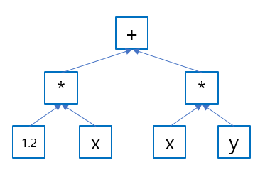

# 표현식 템플릿
## 개요
- 표현식 템플릿은 숫자 배열 클래스를 지원하기 위해 고안된 것이다. 숫자 배열 클래스는 전체 배열 객체에 대한 산술 연산을 지원한다.
> 예를 들어 두 배열을 더하는 연산이라면 각 인자 배열의 값을 더한 값을 갖는 결과 배열을 계산한다.

- 크기가 큰 배열을 계산할 때에는 코드가 실행되는 플랫폼에서 낼 수 있는 한 가장 빠르게 계산하는 것이 중요한데 표현식 템플릿을 사용하면 이를 이룰 수 있다.

## 임시 루프와 루프 분할
- 표현식 템플릿이 필요한 이유를 살펴보기 위해 우선 산술 배열 연산을 하는 템플릿 코드를 작성해 보자.
```c++
// SArray.h
#include <cassert>

template <typename T>
class SArray
{
public:
	explicit SArray( size_t s ) : storage( new T[s] ), storage_size( s )
	{
		init( );
	}

	SArray( const SArray<T>& orig ) : storage( new T[orig.size( )] ), storage_size( orig.size( ) )
	{
		copy( orig );
	}

	SArray( )
	{
		delete[] storage;
	}

	SArray<T>& operator=( const SArray<T>& orig )
	{
		if ( &orig != this )
		{
			copy( orig );
		}

		return *this;
	}

	size_t size( ) const
	{
		return storage_size;
	}

	T operator[] ( size_t idx ) const
	{
		return storage[idx];
	}

	T& operator[] ( size_t idx )
	{
		return storage[idx];
	}

protected:
	void init( )
	{
		for ( size_t idx = 0; idx < size( ); ++idx )
		{
			storage[idx] = T( );
		}
	}

	void copy( const SArray<T>& orig )
	{
		assert( size( ) == orig.size( ) );
		for ( size_t idx = 0; idx < size( ); ++idx )
		{
			storage[idx] = orig.storage[idx];
		}
	}

private:
	T* storage;
	size_t storage_size;
};

template <typename T>
SArray<T> operator+ ( const SArray<T>& lhs, const SArray<T>& rhs )
{
	SArray<T> result( lhs.size( ) );
	for ( size_t k = 0; k < lhs.size( ); ++k )
	{
		result[k] = lhs[k] + rhs[k];
	}
	return result;
}

template <typename T>
SArray<T> operator* ( const SArray<T>& lhs, const SArray<T>& rhs )
{
	SArray<T> result( lhs.size( ) );
	for ( size_t k = 0; k < lhs.size( ); ++k )
	{
		result[k] = lhs[k] * rhs[k];
	}
	return result;
}

template <typename T>
SArray<T> operator* ( const T& lhs, const SArray<T>& rhs )
{
	SArray<T> result( rhs.size( ) );
	for ( size_t k = 0; k < rhs.size( ); ++k )
	{
		result[k] = lhs * rhs[k];
	}
	return result;
}

// 그 밖의 연산자는 생략

// ET_01.cpp
int main( )
{
	SArray<double> x( 1000 ), y( 1000 );

	x = 1.2 * x + x * y;
}
```
- 이런 구현은 다음의 두 이유로 매우 비효율적이다.
1. 연산자는 적어도 하나의 임시 배열을 생성한다.
2. 연산자는 인자와 결과 배열에 대해 부가적으로 탐색한다.

- 실제로 일어나는 일은 임시 배열들을 연산하는 루프의 연속이다.
```
tmp1 = 1.2 * x;
tmp2 = x * y;
tmp3 = tmp1 + tmp2
x = tmp3
```
- 산술 배열 라이브러리의 초기 구현에서는 사용자들이 계산 할당자를 대신 사용해 임시 배열을 줄이게 권유했다. **이런 할당의 장점은 호출자가 인자와 목적지를 모두 제공하므로 임시 배열이 필요하지 않다는 점**이다. 예를 들어 다음과 같은 연산자를 생각해볼 수 있다.
```c++
// ET_02.cpp
template <typename T>
SArray<T>& SArray<T>::operator+= ( const SArray<T>& arg )
{
	for ( size_t k = 0; k < a.size( ); ++k )
	{
		(*this)[k] += arg[k];
	}
	return *this;
}

template <typename T>
SArray<T>& SArray<T>::operator*= ( const SArray<T>& arg )
{
	for ( size_t k = 0; k < a.size( ); ++k )
	{
		( *this )[k] *= arg[k];
	}
	return *this;
}

template <typename T>
SArray<T>& SArray<T>::operator*= ( const T& arg )
{
	for ( size_t k = 0; k < a.size( ); ++k )
	{
		( *this )[k] *= arg;
	}

	return *this;
}

int main( )
{
	SArray<double> x( 1000 ), y( 1000 );

	// 1.2 * x + x * y;
	SArray<double> tmp( x );
	tmp *= y;
	x *= 1.2;
	x += tmp;
}
```
- 하지만 계산 할당을 하더라도 여전히 다음과 같은 문제를 가지고 있다.
1. 표기 방식이 보기에 이상하다.
2. 여전히 임시 tmp라는 배열이 필요하다.
3. 루프가 많은 연산에 분할돼 있기 때문에 메모리 읽기가 6000회 정도 쓰기가 4000회 정도 발생한다.

- 이상적인 방법은 단 하나의 루프로 각 요소마다 전체 표현식을 계산하는 것이다.
```c++
int main
{
    SArray<double> x(1000), y(1000);

    for ( size_t idx = 0; idx < x.size(); ++idx )
    {
        x[idx] = 1.2 * x[idx] + x[idx] * y[idx];
    }  
}
```
- 위 코드는 임시 배열도 필요 없으며 메모리 읽기와 쓰기 횟수도 줄어든다. 다만 표기법이 장황해지고 실수로 인한 오류에 취약하다. 반복문을 직접 작성했을 때의 성능을 귀찮음과 오류 없이 얻을 수 있다면 좋을 것이다.

## 템플릿 인자에 표현식 표현
- 전체 표현식을 다 읽기 전에는 표현식의 일부를 계산하지 않는다면 앞의 문제를 해결할 수 있을 것이다. 그러기 위해서는 계산 하기 전 어떤 객체에 무슨 연산이 적용됐는지 기록하면 된다. **적용될 연산은 컴파일 시간에 결정될 수 있으므로 템플릿 인자로도 표현할 수 있다.**
- 1.2 \* x + x \* y 라는 표현식을 다음과 같은 데이터형을 가지는 객체로 바꿔보자.
```c++
A_Add<A_Mult<A_Scalar<double>, Array<double>>, A_Mult<Array<double>, Array<double>>>
```
- 클래스 템플릿 A\_Scalar, A\_Add, A\_Mult를 사용해서 전치 표현 방식으로 표현식을 나타내었다.

	

### 표현식 템플릿의 피연산자
- 표현식에 대한 표현을 완성하기 위해서는 각 A\_Add와 A\_Mult 객체에 대한 인자의 참조자를 저장하고 A\_Scalar 객체에 저장될 스칼라 값을 기록해야 한다.
```c++
// ExprOps.h
#include <cassert>

template <typename T, typename OP1, typename OP2>
class A_Add
{
private:
	typename A_Traits<OP1>::ExprRef m_lhs;
	typename A_Traits<OP2>::ExprRef m_rhs;

public:
	A_Add( const OP1& lhs, const OP2& rhs ) : m_lhs( lhs ), m_rhs( rhs ) {}

	T operator[] ( size_t idx ) const
	{
		return m_lhs[idx] + m_rhs[idx]
	}

	size_t size( ) const
	{
		assert( m_lhs.size( ) == 0 || m_rhs.size( ) == 0 || m_lhs.size( ) == m_rhs.size( ) );
		return m_lhs.size( ) != 0 ? m_lhs.size( ) : m_rhs.size( );
	}
};

template <typename T, typename OP1, typename OP2>
class A_Mult
{
private:
	typename A_Traits<OP1>::ExprRef m_lhs;
	typename A_Traits<OP2>::ExprRef m_rhs;

public:
	A_Mult( const OP1& lhs, const OP2& rhs ) : m_lhs( lhs ), m_rhs( rhs ) {}

	T operator[] ( size_t idx ) const
	{
		return m_lhs[idx] * m_rhs[idx];
	}

	size_t size( ) const
	{
		assert( m_lhs.size( ) == 0 || m_rhs.size( ) == 0 || m_lhs.size( ) == m_rhs.size( ) );
		return m_lhs.size( ) != 0 ? m_lhs.size( ) : m_rhs.size( );
	}
};
```
- 주어진 객체를 루트로하는 노드의 하위 트리로 표현된 연산들을 통해 배열의 요소 값과 크기를 계산할 수 있다.
- 배열만을 포함한 연산자에서는 결과의 크기와 각 피연산자의 크기가 같다. 하지만 *배열과 스칼라를 모두 포함하는 연산자에서 결과의 크기는 피연산자 배열의 크기*이다. 따라서 피연산자 배열을 스칼라 피연산자와 구별하기 위해 스칼라의 크기는 0으로 정의하였다.
```c++
// ExprOps.h
template <typename T>
class A_Scalar
{
private:
	T const& m_scalar;

public:
	A_Scalar( const T& v ) : m_scalar( v ) {}

	T operator[] ( size_t ) const
	{
		return m_scalar;
	}

	size_t size( ) const
	{
		return 0;
	}
};
```
- 스칼라도 인덱스 연산자를 제공한다. 표현식 내에서 스칼라는 모든 인덱스에 대해 같은 값을 제공하는 배열이라 볼 수 있다.
- 연산자 클래스는 도우미 클래스 A_Traits를 사용해 피연산자를 위한 멤버를 정의했다. 일반적으로 대부분의 임시 노드들은 최상위 표현식과 관련이 있기 때문에 전체 표현식을 모두 계산할 때까지 계속 살아남아 있어야한다. 따라서 임시 노드를 참조할 수 있는 형태로 선언해도 된다. A\_Scalar 노드는 예외다. 이들은 연산자 함수에 연결되며 전체 표현식의 계산이 종료 전에 사라진다. 따라서 값으로 복사돼야만 한다.
> 일반적으로는 상수 참조된다. <br>
const OP1& op1; <br>
const OP2& op2; <br>
스칼라일 경우 일반 값이다. <br>
OP1 op1 <br>
OP2 op2

- 이것이 특질 클래스를 사용하는 응용 사례이다. 특질 클래스틑 일반적으로 상수 참조자지만 스칼라일 경우에는 일반 값을 가지는 데이터형을 정의한다.
```c++
// ExprOps.h
template <typename T>
class A_Traits
{
public:
	using ExprRef = const T&;
};

template <typename T>
class A_Scalar;

template <typename T>
class A_Traits<A_Scalar<T>>
{
public:
	using ExprRef = A_Scalar<T>;
};
```

### Array형
- 전체 표현식 템플릿을 만들었으니 이제는 표현식 템플릿을 이용하는 Array 형을 만들어야 한다. 이 때 저장소와 표현식을 표현하는 인터페이스가 실제 배열과 유사할수록 좋다. 따라서 Array 템플릿은 다음과 같이 선언된다.
```c++
template <typename T, typename Rep = SArray<T>>
class Array
```
- Rep형은 Array가 값을 저장하는 배열일 경우 SArray가 되며 A\_Add나 A\_Mult 처럼 표현식을 나타낼 경우에는 중첩된 템플릿 식별자가 된다.
```c++
// ET_04.cpp
#include <cassert>

template <typename T, typename Rep = SArray<T>>
class Array
{
private:
	Rep expr_rep;

public:
	explicit Array( size_t s ) : expr_rep( s ) {}

	Array( const Rep& rb ) : expr_rep( rb ) {}

	Array& operator= ( const Array& b )
	{
		assert( size( ) == b.size( ) );
		for ( size_t idx = 0; idx < b.size( ); ++idx )
		{
			expr_rep[idx] = b[idx];
		}
		return *this;
	}

	template <typename T2, typename Rep2>
	Array& operator= ( const Array<T2, Rep2>& b )
	{
		assert( size( ) == b.size( ) );
		for ( size_t idx = 0; idx < b.size( ); ++idx )
		{
			expr_rep[idx] = b[idx];
		}
		return *this;
	}

	size_t size( ) const
	{
		return expr_rep.size( );
	}

	T operator[] ( size_t idx ) const
	{
		assert( idx < size( ) );
		return expr_rep[idx];
	}

	T& operator[] ( size_t idx )
	{
		assert( idx < size( ) );
		return expr_rep[idx];
	}

	const Rep& rep( ) const
	{
		return expr_rep;
	}

	Rep& rep( )
	{
		return expr_rep;
	}
};
```
- 위 코드의 많은 연산들이 Rep 객체로 전달되기만 하는데 배열을 복사할 때는 그 배열이 표현식 템플릿을 쓰고 있을지도 모르기 때문에 복사 연사자를 Rep2를 사용해 파라미터화 했다.

### 연산자
- 이제 모든 준비가 끝났고 연산자를 완성하면 된다. 이런 연산자들은 표현식 템플릿 객체를 구축할 뿐 결과 배열을 계산하지 않다.
- 일반적인 이항 연산자를 위해 배열-배열, 배열-스칼라, 스칼라-배열 세 버전의 연산자를 구현했다.
```c++
// ET_05.cpp
template <typename T, typename R1, typename R2>
Array<T, A_Add<T, R1, R2>> operator+( const Array<T, R1>& lhs, const Array<T, R2>& rhs )
{
	return Array<T, A_Add<T, R1, R2>>( A_Add<T, R1, R2>( lhs.rep( ), rhs.rep( ) ) );
}

template <typename T, typename R1, typename R2>
Array<T, A_Mult<T, R1, R2>> operator*( const Array<T, R1>& lhs, const Array<T, R2>& rhs )
{
	return Array<T, A_Mult<T, R1, R2>>( A_Mult<T, R1, R2>( lhs.rep( ), rhs.rep( ) ) );
}

template <typename T, typename R2>
Array<T, A_Mult<T, A_Scalar<T>, R2>> operator*( const T& lhs, const Array<T, R2>& rhs )
{
	return Array<T, A_Mult<T, A_Scalar<T>, R2>>( A_Mult<T, A_Scalar<T>, R2>( A_Scalar<T>(lhs), rhs.rep( ) ) );
}
```

### 복습
- 예제코드를 통해서 표현식 템플릿이 어떻게 동작하는지 살펴보자.
```c++
int main( )
{
	Array<double> x( 1000 ), y( 1000 );

	x = 1.2 * x + x * y;
}
```
- 위 코드는 다음과 같이 변환된다.
1. x 와 y는 Rep 인자가 빠져있으므로 SArray로 정해진다.
2. 1.2 \* x + x \* y 에서 가장 왼쪽에 있는 \* 연산인 스칼라-배열 연산자가 가장 먼저 처리되어 결과의 데이터형이 Array\<double, A_Mult\<double, A_Scalar\<double\>, SArray\<double\>\>\> 이 된다.
3. 다음으로 두 번째 곱셈이 계산된다. 배열-배열 연산자로 처리되며 결과의 데이터형은 Array\<double, A_Mult\<double, SArray\<double\>, SArray\<double\>\>\> 이 된다.
4. 마지막으로 + 연산이 계산된다. 배열-배열 연산이며 피연산자 형은 앞에서 처리한 데이터형을 가져 최종적으로는 Array\<double, A_Add\<double, A_Mult\<double, A_Scalar\<double\>, SArray\<double\>\>, A_Mult\<double, SArray\<double\>, SArray\<double\>\>\>\> 이 된다.

- 주어진 idx 인덱스에 대해서 []연산자를 추적하면 원하던 대로 다음 식이 계산된다. <br>
1.2 \* x[idx] \+ x[idx] \* y[idx];

### 표현식 템플릿 할당
- 예제에서 사용한 A\_Mult와 A\_Add 표현식 템플릿을 기반으로 하는 Rep 인자를 통해 배열에 대한 쓰기 연산을 인스턴스화하는 것은 불가능하다.
> a+b = c 라고 쓰는 것이 말이 안된다.

- 하지만 결과로 할당이 가능한 다른 표현식 템플릿을 만들수 있다. 예를 들어 정수값의 배열을 인덱스로 사용하는 것은 하위 집합 선택이라고 볼 수 있다.
```c++
x[y] = 2*x[y];

// 즉 다음을 뜻한다고 할 수 있다.
for ( size_t idx = 0; idx < y.size(); ++idx )
{
	x[y[idx]] = 2*x[y[idx]];
}
```
- 이것이 가능하다는 것은 lvalue처럼 동작하는 표현식 템플릿을 기반으로 배열을 설계한다는 의미이다. 이를 위한 표현식 템플릿 컴포넌트는 첨자 연산자에서 const와 const가 아닌 버전을 모두 제공해야 하며 lvalue를 반환해야 한다.
```c++
// ExprOps.h 
template <typename T, typename A1, typename A2>
class A_Subscript
{
public:
	A_Subscript( const A1& a, const A2& b ) : a1( a ), a2( b ) {}

	T operator[] ( size_t idx ) const
	{
		return a1[a2[idx]];
	}

	T& operator[] ( size_t idx )
	{
		return a1[a2[idx]];
	}

	size_t size( ) const
	{
		return a2.size( );
	}

private:
	const A1& a1;
	const A2& a2;
};
```
- A\_Add나 A\_Mult 와 마찬가지로 A\_Subscript 도 Array에서 사용하기 위한 연산자를 추가해야 한다. 추가돼야 하는 연산자는 다음과 같이 정의된다.
```c++
// ET_06.cpp
template <typename T, typename Rep>
template <typename T2, typename R2>
Array<T, A_Subscript<T, Rep, R2>> Array<T, Rep>::operator[]( const Array<T2, R2>& b )
{
	return Array<T, A_Subscript<T, Rep, R2>>( A_Subscript<T, Rep, R2>( *this, b ) );
}
```

## 표현식 템플릿의 성능과 한계
- 표현식 템플릿은 상당히 복잡하지만 배열 연산의 성능을 굉장히 향상시킨다.
- 다만 배열에 대한 수치 계산을 포함한 모든 문제 상황을 해결하지 않는다. 예를 들어 표현식 템플릿을 행렬 벡터 곱셈에 사용한다고 한다면 다음의 곱셈에서는 제대로 동작하지 않는다.
```
x = A * x;
```
- 여기서 A는 N x N 행렬이고 x는 크기가 N인 열벡터라고 하면 결과 값의 각 요소가 원래 x의 요소에 따라 달라지기 때문에 임시 변수가 반드시 필요하다는 점이다. 반면 위 식을 약간 바꾼 표현식 x = A \* y 는 실제 x와 y가 같은 것을 지칭하지 않는 다면 임시 변수가 필요하지 않다.
- 따라서 이 식을 계산하기 위해서는 실행 시간에 피연산자들이 갖는 관계를 알아야 한다는 한계가 있다.