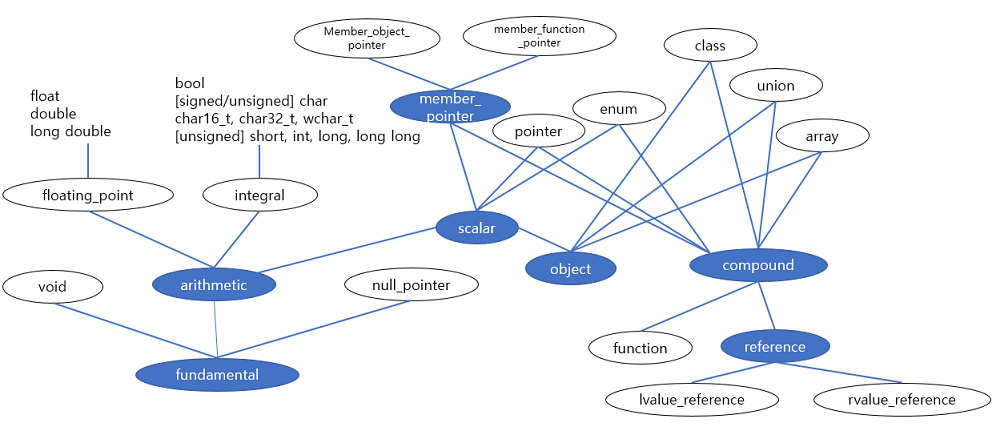

# 데이터형 분류
## 개요
- 템플릿 파라미터가 내장 데이터형인지, 포인터형인지 클래스형인지 등을 아는 것이 유용할 때가 있다. 이를 이용하면 다음과 유사한 코드를 작성할 수 있다.
```c++
if ( TypeT<T>::IsPtrT )
{
    // ...
}
else if ( TypeT<T>IsClassT )
{
    // ...
}
```

## 기초형 결정
- 데이터형이 기초형( fundamental type )인지 결정하는 것으로 부터 출발한다. 기본적으로 데이터형이 기초형이 아니라고 가정하고 기초형일 경우 템플릿을 특수화한다.
```c++
#include <type_traits>

template <typename T>
class IsFundaT : public std::false_type {};

#define MK_FUNDA_TYPE(T) \
template <> class IsFundaT<T> : public std::true_type {};

MK_FUNDA_TYPE( void );

MK_FUNDA_TYPE( bool );
MK_FUNDA_TYPE( char );
MK_FUNDA_TYPE( signed char );
MK_FUNDA_TYPE( unsigned char );
MK_FUNDA_TYPE( wchar_t );
MK_FUNDA_TYPE( char16_t );
MK_FUNDA_TYPE( char32_t );

MK_FUNDA_TYPE( signed short );
MK_FUNDA_TYPE( unsigned short );
MK_FUNDA_TYPE( signed int );
MK_FUNDA_TYPE( unsigned int );
MK_FUNDA_TYPE( signed long );
MK_FUNDA_TYPE( unsigned long );
MK_FUNDA_TYPE( signed long long );
MK_FUNDA_TYPE( unsigned long long );

MK_FUNDA_TYPE( float );
MK_FUNDA_TYPE( double );
MK_FUNDA_TYPE( long double );

MK_FUNDA_TYPE( std::nullptr_t );

#undef MK_FUNDA_TYPE
```
- 일반적인 경우 IsFundaT\<T\>::value는 false로 평가된다.
```c++
template <typename T>
class IsFundaT : public std::false_type {}; 

// 은 결국 아래와 같다.
template <typename T>
class IsFundaT {
    static constexpr bool value = false;
}; 
```
- 특수화된 몇몇 자료형에 대해서 IsFundaT\<T\>::value는 true로 평가된다.
```c++
MK_FUNDA_TYPE( bool );

// 은 결국 아래와 같고
template <>
class IsFundaT<bool> : public std::true_type {}; 

// 은 결국 아래와 같다.
template <>
class IsFundaT<bool> {
    static constexpr bool value = true;
}; 
```
- 이런 기초형을 판단하는 클래스 템플릿은 다음과 같이 사용할 수 있다.
```c++
template <typename T>
void test( const T& )
{
	if ( IsFundaT<T>::value )
	{
		std::cout << "T is a fundamental type" << std::endl;
	}
	else
	{
		std::cout << "T is not a fundamental type" << std::endl;
	}
}

int main( )
{
	test( 7 );
	test( "hello" );
}
```
- 같은 방식으로 float 형이나 integral scalar 형을 판단하는 데이터형 함수를 정의할 수 있다.
- C++ 표준 라이브러리에서는 좀 더 잘 정제된 방법을 사용하고 있는데 어떤 타입이 기초형인지 판단하기 보다는 기본 자료형( primary type category ) 카테고리를 정의해서 각 자료형이이 하나의 자료형 카테고리에 속하도록 하고 그것을 조합하여 기초형과 같은 조합된 자료형을 정의한다.

    

## 복합형 결정
- 복합형 ( compound type )은 다른 데이터형에서 생성된 데이터형이다. 간단한 복합형은 포인터형, lvalue 와 rvalue 참조형, 멤버 타입에 대한 포인터형과 배열이 포함된다. 이들은 하나의 기본 데이터형으로 생성되며 클래스형과 함수형 역시 복합형이다.
> 다만 클래스형과 함수형은 다양한 테이터형( 파라미터나 멤버 )를 포함한다.

- 간단한 복합형은 부분 특수화를 사용해 분류할 수 있다.

### 포인터
- 포인터형을 분류하는 코드는 다음과 같다.
```c++
template <typename T>
class IsPointerT : public std::false_type {};

template <typename T>
class IsPointerT<T*> : public std::true_type 
{
public:
	using BaseT = T;
};

```
- 기본 템플릿은 모든 포인터형이 아닌 자료형을 처리한다. IsPointerT의 value는 부모 클래스 std::false_type으로 인해 false가 된다.
- 부분 특수화는 포인터형(T*)인 자료형을 처리하며 value는 ture를 가진다. 추가적으로 포인터가 가리키는 자료형을 나타내는 자료형 멤버 BaseT를 제공한다. 한 가지 알아되야할 점은 BaseT는 자료형이 포인터형일 때만 유효하다는 점이다.
- C++ 표준 라이브러리는 IsPointerT에 해당하는 std::is_pointer\<\> 클래스 템플릿을 제공한다. 다만 포인터가 가리키는 자료형 멤버를 제공하지 않는다.

### 참조
- 비슷하게 lvalure 참조형을 판단할 수 있다.
```c++
template <typename T>
class IsLValueReferenceT : public std::false_type {};

template <typename T>
class IsLValueReferenceT<T&> : public std::true_type
{
public:
	using BaseT = T;
};
```
- 그리고 rvalue 참조형은 다음과 같다.
```c++
template <typename T>
class IsRValueReferenceT : public std::false_type {};

template <typename T>
class IsRValueReferenceT<T&&> : public std::true_type
{
public:
	using BaseT = T;
};
```
- 이 둘을 합성하여 IsReference/</> 특성을 정의할 수 있다.
```c++
template <typename T>
class IsReferenceT : public std::conditional<IsLValueReferenceT<T>::value, IsLValueReferenceT<T>, IsRValueReferenceT<T>>::type
{
};
```
- 이 구현에서는 부모 클래스를 IsLValueReference와 IsRValueReference중 어떤 클래스로 할지 선택하기 위해서 std::conditional을 사용하였다.
- 만약 T가 lvalue 참조라면 IsLValueReference가 선택되어 value와 BaseT 멤버에 접근할 수 있다. 반면에 IsRValueReference 라면 자료형이 rvalue 참조인지 판단하게 된다.
- C++ 표준 라이브러리에서는 std::is\_lvalue\_reference\<\>, std::is\_rvalue\_reference\<\>, std::is\_reference\<\> 클래스 템플릿을 제공하며 마찬가지로 참조형이 참조는 자료형에 대한 멤버 자료형은 제공되지 않는다.

### 배열
- 배열을 판별하는 특성을 정의할 때 부분 특수화가 더 많은 템플릿 파라메터를 갖는 점은 조금 놀라울 수 있다.
```c++
template <typename T>
class IsArrayT : public std::false_type {};

template <typename T, std::size_t N>
class IsArrayT<T[N]> : public std::true_type
{
public:
	using BaseT = T;
	static constexpr std::size_t size = N;
};

template <typename T>
class IsArrayT<T[]> : public std::true_type
{
public:
	using BaseT = T;
	static constexpr std::size_t size = 0;
};
```
- 이 구현에는 배열을 위한 추가적인 정보를 제공하는 멤버가 제공된다.
-C++ 표준 라이브러리에서는 std::is\_array\<\> 를 제공하여 자료형이 배열인지 판단한다. 게다가 std::rank\<\>, std::extent\<\> 를 제공하여 배열의 차원 수와 각 차원별 원소의 개수를 판단할 수 있게 하였다.

### 클래스 멤버 변수 포인터
- 클래스 멤버 변수에 대한 포인터도 같은 기술로 다룰 수 있다.
```c++
template <typename T>
class IsPointerToMemberT : public std::false_type {};

template <typename T, typename C>
class IsPointerToMemberT<T C::*> : public std::true_type
{
public:
	using MemberT = T;
	using ClassT = C;
};

```
- 추가적으로 멤버의 자료형과 클래스의 자료형을 나타내는 멤버를 제공한다.
- C++ 표준 라이브러리에서는 std::is\_member\_object\_pointer\<\>, std::is\_member\_function\_pointer\<\> 와 std::is\_memeber\_pointer\<\> 를 통해서 좀 더 구체화된 특성을 제공한다.

## 함수형 식별
- 함수형은 조금 흥미로운데 함수가 가질 수 있는 파라미터의 수가 정해져 있지 않기 때문이다. 따라서 부분 특수화로 함수형을 매칭시키기 위해서 파라미터 팩(parameter pack)을 도입하여 해결한다.
```c++
template <typename... Elements>
class TypeList {};

template <typename T>
class IsFunctionT : public std::false_type {};

template <typename R, typename... Params>
class IsFunctionT<R( Params... )> : public std::true_type
{
public:
	using Type = R;
	using PraramsT = TypeList<Params...>;
	static constexpr bool variadic = false;
};

template <typename R, typename... Params>
class IsFunctionT<R( Params..., ... )> : public std::true_type
{
public:
	using Type = R;
	using PraramsT = TypeList<Params...>;
	static constexpr bool variadic = true;
};
```
- 함수형의 각 부분이 노출되는 것을 살펴보자. Type은 반환형이 무엇인지를 나타내고 모든 함수 인자는 하나의 TypeList로 ParamT로 캡쳐되었다. 그리고 varidic은 함수형이 C-style의 가변인자 함수형인지를 표시한다.
- 안타깝게도 IsFunctionT가 모든 함수형을 다루지는 못한다. 왜냐하면 함수형은 const, volatile, lvalue(&), rvalue(&&)와 같은 한정자를 가질 수 있기 때문이다.
- 게다가 const로 한정된 함수형은 실제로 const 형이 아니다. 그래서 std::remove_const로도 함수형에서 const를 제거할 수 있다. 그러므로 한정자를 가진 함수형을 위해서 추가적으로 많은 수의 부분 특수화가 필요하다. 다음 코드는 그 중 일부를 소개한다.
```c++
template <typename R, typename... Params>
class IsFunctionT<R( Params... ) const>  : public std::true_type
{
public:
	using Type = R;
	using PraramsT = TypeList<Params...>;
	static constexpr bool variadic = true;
};

template <typename R, typename... Params>
class IsFunctionT<R ( Params..., ...) volatile> : public std::true_type
{
public:
	using Type = R;
	using PraramsT = TypeList<Params...>;
	static constexpr bool variadic = true;
};

template <typename R, typename... Params>
class IsFunctionT<R( Params..., ... ) const volatile> : public std::true_type
{
public:
	using Type = R;
	using PraramsT = TypeList<Params...>;
	static constexpr bool variadic = true;
};

template <typename R, typename... Params>
class IsFunctionT<R ( Params..., ... ) &> : public std::true_type
{
public:
	using Type = R;
	using PraramsT = TypeList<Params...>;
	static constexpr bool variadic = true;
};

template <typename R, typename... Params>
class IsFunctionT<R ( Params..., ... ) const&> : public std::true_type
{
public:
	using Type = R;
	using PraramsT = TypeList<Params...>;
	static constexpr bool variadic = true;
};
```
- 이제 우리는 클래스형과 열거형을 제외한 모든 형을 식별할 수 있게 되었다. 클래스형과 열거형은 이어서 다룰 것이다.
- C++ 표준 라이브러리에서는 std::is\_function\<\>을 제공하여 함수형을 분류할 수 있게 하였다.

## 클래스형 식별
- 다른 복합형들과는 다르게 클래스형을 식별하는 부분 특수화는 없다. 대신 클래스형에 유효한 표현을 통해 SFINAE를 이용해서 이를 우회하여 처리할 수 있다.
- 이 상황에서 이용할 수 있는 클래스형의 특징은 바로 멤버 자료형에 대한 포인터이다. IsClassT\<\>는 이 속성을 이용하여 구현된다.
```c++
template <typename T, typename = std::void_t<>>
class IsClassT : public std::false_type {};

template <typename T>
class IsClassT<T, std::void_t<int T::*>> : public std::true_type {};
```
- C++ 언어에서 람다 표현식은 "유일하고 이름이 없는 union이 아닌 클래스 형" 이므로 IsClassT에 람다 표현식을 사용하며 true가 된다.
```c++
```
- 또한 union도 int T::\*와 같은 표현이 유효하다.
> C++ 표준에서는 union도 클래스 타입이다.

- C++ 표준 라이브러리는 std::is\_class\<\> 와 std::is\_union\<\>을 제공한다. 다만 이 특성은 컴파일러의 지원이 필요한데 표준 언어 기법으로는 구조체형과 클래스형을 uinon과 구별할 수 없기 때문이다.

## 열거형 식별
- 마지막까지 아직 분류하지 않는 자료형이 남아있는데 바로 열거형이다.
- 열거형인지 테스트하는 코드는 기초형, 클래스형, 참조형, 포인터 형, 멤버에 대한 포인터형을 제외하고 정수형으로 명시적으로 치환될 수 있는지를 검사하는 SFINAE 기반의 특성으로 작성할 수 있지만 여기서는 간단하게 앞에서 정의한 어떤 타입에도 속하지 않으면 열거형인 것으로 판단할 수 있다.
```c++
template <typename T>
class IsEnumT
{
public:
	static constexpr bool value = !IsFundaT<T>::value &&
							      !IsPointerT<T>::value &&
							      !IsReferenceT<T>::value &&
							      !IsArrayT<T>::value &&
							      !IsPointerToMemberT<T>::value &&
							      !IsFunctionT<T>::value &&
							      !IsClassT<T>::value;
};
```
- C++ 표준에서는 std::is\_enum\<\>로 열거형을 분류할 수 있다. 대체적으로 컴파일 성능을 높이기 위해서 위 코드와 같은 구현보다는 컴파일러에서 직접 해당 특성을 지원하도록 구현되어 있다.