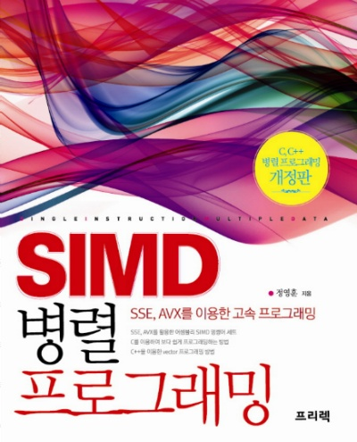

# SIMD 병렬 프로그래밍 스터디

# 목차
## [Ch.01](./src/Ch.01) 기본 어셈블리 명령어
1. [mov](./src/Ch.01/01_mov.cpp) : 대입
2. [add](./src/Ch.01/02_add.cpp) : 더하기
3. [sub](./src/Ch.01/03_sub.cpp) : 빼기
4. [mul](./src/Ch.01/04_mul.cpp) : 곱하기
5. [div](./src/Ch.01/05_div.cpp) : 나누기
6. [inc & dec](./src/Ch.01/06_inc_dec.cpp) : 증감
7. [shift](./src/Ch.01/07_shift.cpp) : 비트 쉬프트
8. [cmp](./src/Ch.01/08_cmp.cpp) : 비교
9. [jump](./src/Ch.01/09_jump.cpp) : 분기

## [Ch.02](./src/Ch.02) 정수 SIMD 명령어
1. [mov](./src/Ch.02/01_mov.cpp) : 대입
2. [logical operations](./src/Ch.02/02_logical_ops.cpp) : 논리 연산
3. [add](./src/Ch.02/03_add.cpp) : 더하기
4. [sub](./src/Ch.02/04_sub.cpp) : 빼기
5. [Get Sum](./src/Ch.02/05_GetSum.cpp) : 배열의 원소 총합 계산
6. [mul](./src/Ch.02/06_mul.cpp) : 곱하기
7. [max, min](./src/Ch.02/07_max_min.cpp) : 최대, 최소
8. [GetMax](./src/Ch.02/08_GetMax.cpp) : 배열의 원소중 최대 값 구하기
9. [avg](./src/Ch.02/09_avg.cpp) : 평균
10. [cmp](./src/Ch.02/10_cmp.cpp) : 비교
11. [bit mask](./src/Ch.02/11_bitmask.cpp) : 비트 마스크
12. [Count](./src/Ch.02/12_Count.cpp) : 배열의 원소중 특정 숫자의 갯수를 세기
13. [extract, insert](./src/Ch.02/13_extract_insert.cpp) : pack의 값 넣기, 꺼내기
14. [Count 2](./src/Ch.02/14_Count2.cpp) : 배열의 원소중 특정 숫자의 갯수를 세기2
15. [Find Position](./src/Ch.02/15_FindPosition.cpp) : 배열 안의 특정 숫자의 위치를 검색
16. [shift](./src/Ch.02/16_shift.cpp) : 비트 쉬프트
17. [Find Position 2](./src/Ch.02/17_FindPosition2.cpp) : 배열 안의 특정 숫자의 위치를 검색2
18. [div](./src/Ch.02/18_div.cpp) : 정수 나누기
19. [unpack](./src/Ch.02/19_unpack.cpp) : 레지스터 unpack
20. [Get Sum 2](./src/Ch.02/20_GetSum2.cpp) : 배열의 원소 총합 계산2
21. [shuffle](./src/Ch.02/21_shuffle.cpp) : 레지스터 pack 섞기
22. [casting](./src/Ch.02/22_casting.cpp) : 자료형 변환
23. [FadeIn FadeOut](./src/Ch.02/23_FadeInFadeOut.cpp) : 이미지 혼합 [(Result1.bmp ~ Result7.bmp)](./src/Resource/FadeInFadeOut)
24. [Sharpen Filter](./src/Ch.02/24_SharpenFilter.cpp) : SharpenFilter [(SharpenBySIMD.bmp)](./src/Resource/SharpenFilter)

## [Ch.03](./src/Ch.03) 실수 SIMD 명령어
1. [mov](./src/Ch.03/01_mov.cpp) : 대입
2. [logical operations](./src/Ch.03/02_logical_ops.cpp) : 논리 연산
3. [add](./src/Ch.03/03_add.cpp) : 더하기
4. [sub](./src/Ch.03/04_sub.cpp) : 뺴기
5. [Matrix Add](./src/Ch.03/05_matrix_add.cpp) : 행렬 더하기
6. [mul](./src/Ch.03/06_mul.cpp) : 곱하기
7. [div](./src/Ch.03/07_div.cpp) : 나누기
8. [rcp](./src/Ch.03/08_rcp.cpp) : 역수
9. [sqrt](./src/Ch.03/09_sqrt.cpp) : 제곱근
10. [rsqrt](./src/Ch.03/10_rsqrt.cpp) : 제곱근의 역수
11. [hadd](./src/Ch.03/11_hadd.cpp) : 수평 더하기
12. [Closest Distance](./src/Ch.03/12_ClosestDistance.cpp) : 두 사각형의 꼭지점간 가장 가까운 거리 구하기
13. [shuffle](./src/Ch.03/13_shuffle.cpp) : 레지스터 pack 섞기
14. [Matrix multiply](./src/Ch.03/14_matrix_multiply.cpp) : 행렬 곱하기
15. [Mememory Copy](./src/Ch.03/15_memcpy.cpp) : 메모리 복사

## [Ch.04](./src/Ch.04) 정수 Intrinsic 함수
1. [overview](./src/Ch.04/01_overview.cpp) : 개요
2. [read, write](./src/Ch.04/02_read_write.cpp) : 메모리에서 읽기, 쓰기
3. [add](./src/Ch.04/03_add.cpp) : 더하기
4. [sub](./src/Ch.04/04_sub.cpp) : 빼기
5. [mul](./src/Ch.04/05_mul.cpp) : 곱하기
6. [max_min](./src/Ch.04/06_max_min.cpp) : 최대, 최소
7. [avg](./src/Ch.04/07_avg.cpp) : 평균
8. [other arithmetic](./src/Ch.04/08_other_arithmetic.cpp) : 그외 연산( 곱 합 계산, 편차의 총합 )
9. [Get Sum](./src/Ch.04/09_GetSum.cpp) : 배열의 원소 총합 계산
10. [Get Abs](./src/Ch.04/10_GetAbs.cpp) : 배열 각 원소의 절대값 계산
11. [set](./src/Ch.04/11_set.cpp) : 레지스터 pack 설정
12. [logical operations](./src/Ch.04/12_logical_ops.cpp) : 논리 연산
13. [shift](./src/Ch.04/13_shift.cpp) : 비트 쉬프트
14. [div](./src/Ch.04/14_div.cpp) : 나누기
15. [cmp](./src/Ch.04/15_cmp.cpp) : 비교
16. [Select](./src/Ch.04/16_Select.cpp) : 특정 수보다 작은 요소를 0으로 변경
17. [unpack](./src/Ch.04/17_unpack.cpp) : 레지스터 unpack
18. [shuffle](./src/Ch.04/18_shuffle.cpp) : 레지스터 pack 섞기
19. [extract, insert, bitmask](./src/Ch.04/19_extract_insert_bitmask.cpp) : pack의 값 넣기, 꺼내기, 비트 마스크
20. [casting](./src/Ch.04/20_casting.cpp) : 자료형 변환
21. [Sharpen Filter](./src/Ch.04/21_SharpenFilter.cpp) : SharpenFilter [(SharpenByIntrinsic.bmp)](./src/Resource/SharpenFilter)
22. [Edge Detect](./src/Ch.04/22_EdgeDetect.cpp) : 외곽선 검출 [(EdgeDetectByIntrinsic.bmp)](./src/Resource/EdgeDetect)

## [Ch.05](./src/Ch.05) 단정밀도 실수 Intrinsic 함수
1. [overview](./src/Ch.05/01_overview.cpp) : 개요
2. [read, write](./src/Ch.05/02_read_write.cpp) : 메모리에서 읽기, 쓰기
3. [arithmetic](./src/Ch.05/03_arithmetic.cpp) : 사칙연산
4. [Standard Deviation](./src/Ch.05/04_StandardDeviation.cpp) : 표준 편차 구하기
5. [set](./src/Ch.05/05_set.cpp) : 레지스터 pack 설정
6. [matrix multiply](./src/Ch.05/06_matrix_multiply.cpp) : 행렬 곱하기
7. [logical operations](./src/Ch.05/07_logical_ops.cpp) : 논리 연산
8. [cmp](./src/Ch.05/08_cmp.cpp) : 비교
9. [Select](./src/Ch.05/09_Select.cpp) : 특정 수보다 작은 요소를 0으로 변경
10. [casting](./src/Ch.05/10_casting.cpp) : 자료형 변환
11. [shuffle, unpack](./src/Ch.05/11_shuffle_unpack.cpp) : 레지스터 pack 섞기, 레지스터 unpack
12. [cache](./src/Ch.05/12_cache.cpp) : 캐시 관련 함수
13. [improve matrix multiply](./src/Ch.05/13_improve_matrix_multiply.cpp) : 행렬 곱하기 개선

## [Ch.06](./src/Ch.06) 배정밀도 실수 Intrinsic 함수
1. [overview](./src/Ch.06/01_overview.cpp) : 개요
2. [read, write](./src/Ch.06/02_read_write.cpp) : 메모리에서 읽기, 쓰기
3. [arithmetic](./src/Ch.06/03_arithmetic.cpp) : 사칙연산
4. [set](./src/Ch.06/04_set.cpp) : 레지스터 pack 설정
5. [logical operations](./src/Ch.06/05_logical_ops.cpp) : 논리 연산
6. [cmp](./src/Ch.06/06_cmp.cpp) : 비교
7. [casting](./src/Ch.06/07_casting.cpp) : 자료형 변환
8. [cache](./src/Ch.06/08_cache.cpp) : 캐시 관련 함수
9. [Factorial](./src/Ch.06/09_Factorial.cpp) : Factorial 구하기

## [Ch.07](./src/Ch.07) 정수 Vector 클래스
1. [overview](./src/Ch.07/01_overview.cpp) : 개요
2. [declaration](./src/Ch.07/02_declaration.cpp) : 선언 및 초기화
3. [read, write](./src/Ch.07/03_read_write.cpp) : 메모리에서 읽기, 쓰기
4. [arithmetic](./src/Ch.07/04_arithmetic.cpp) : 사칙 연산
5. [max, min](./src/Ch.07/05_max_min.cpp) : 최대, 최소
6. [Find Max Value](./src/Ch.07/06_FindMaxValue.cpp) : 배열에서 최대 값 찾기
7. [shift](./src/Ch.07/07_shift.cpp) : 비트 쉬프트
8. [logical operations](./src/Ch.07/08_logical_ops.cpp) : 논리 연산
9. [cmp](./src/Ch.07/09_cmp.cpp) : 비교
10. [select](./src/Ch.07/10_select.cpp) : 비교후 값을 선택
11. [unpack](./src/Ch.07/11_unpack.cpp) : 레지스터 unpack
12. [pack](./src/Ch.07/12_pack.cpp) : 레지스터 pack
13. [Sharpen Filter](./src/Ch.07/13_SharpenFilter.cpp) : SharpenFilter [(SharpenByVector.bmp)](./src/Resource/SharpenFilter)
14. [debugging](./src/Ch.07/14_debugging.cpp) : 디버깅
15. [clear register](./src/Ch.07/15_clear_register.cpp) : xmm 레지스터 정리

## [Ch.08](./src/Ch.08) 실수 Vector 클래스
1. [overview](./src/Ch.08/01_overview.cpp) : 개요
2. [declaration](./src/Ch.08/02_declaration.cpp) : 선언 및 초기화
3. [read, write](./src/Ch.08/03_read_write.cpp) : 메모리에서 읽기, 쓰기
4. [arithmetic](./src/Ch.08/04_arithmetic.cpp) : 사칙 연산
5. [Get Sum Float](./src/Ch.08/05_GetSumFloat.cpp) : 배열의 원소 총합
6. [math](./src/Ch.08/06_math.cpp) : 기타 수학 연산
7. [max, min](./src/Ch.08/07_max_min.cpp) : 최대, 최소
8. [Standard Deviation](./src/Ch.08/08_StandardDeviation.cpp) : 표준 편차
9. [logical operations](./src/Ch.08/09_logical_ops.cpp) : 논리 연산
10. [cmp](./src/Ch.08/10_cmp.cpp) : 비교
11. [select](./src/Ch.08/11_select.cpp) : 비교후 값을 선택
12. [cache](./src/Ch.08/12_cache.cpp) : 캐시 관련 함수
13. [unpack](./src/Ch.08/13_unpack.cpp) : 레지스터 unpack
14. [debugging](./src/Ch.08/14_debugging.cpp) : 디버깅
15. [bitmask](./src/Ch.08/15_bitmask.cpp) : 비트 마스크
16. [matrix multiply](./src/Ch.08/16_matrix_multiply.cpp) : 행렬 곱하기

## [Ch.09](./src/Ch.09) AVX 명령어
1. [overview](./src/Ch.09/01_overview.cpp) : 개요
2. [mov](./src/Ch.09/02_mov.cpp) : 메모리에서 읽기, 쓰기
3. [logical operations](./src/Ch.09/03_logical_ops.cpp) : 논리 연산
4. [arithmetic](./src/Ch.09/04_arithmetic.cpp) : 사칙 연산
5. [cmp](./src/Ch.09/05_cmp.cpp) : 비교
6. [select](./src/Ch.09/06_select.cpp) : 비교후 값을 선택
7. [math](./src/Ch.09/07_math.cpp) : 기타 수학 연산
8. [hadd](./src/Ch.09/08_hadd.cpp) : 수평 더하기
9. [casting](./src/Ch.09/09_casting.cpp) : 자료형 변환
10. [register clear](./src/Ch.09/10_register_clear.cpp) : 레지스터 초기화
11. [insert](./src/Ch.09/11_insert.cpp) : 128bit 데이터를 256bit 레지스터 절반에 입력
12. [byte to float](./src/Ch.09/12_byte2float.cpp) : 바이트 데이터를 실수형으로 변환

## [Ch.10](./src/Ch.10) AVX Intrinsic 함수
1. [overview](./src/Ch.10/01_overview.cpp) : 개요
2. [read, write](./src/Ch.10/02_read_write.cpp) : 메모리에서 읽기, 쓰기
3. [logical operations](./src/Ch.10/03_logical_ops.cpp) : 논리 연산
4. [arithmetic](./src/Ch.10/04_arithmetic.cpp) : 사칙 연산
5. [Get Sum Float](./src/Ch.10/05_GetSumFloat.cpp) : 배열의 원소 총합
6. [max, min](./src/Ch.10/06_max_min.cpp) 최대, 최소
7. [math](./src/Ch.10/07_math.cpp) : 기타 수학 연산
8. [set](./src/Ch.10/08_set.cpp) : 레지스터 pack 설정
9. [extract](./src/Ch.10/09_extract.cpp) : pack에 값 꺼내기
10. [insert](./src/Ch.10/10_insert.cpp) : pack에 값 넣기
11. [cmp](./src/Ch.10/11_cmp.cpp) : 비교
12. [casting](./src/Ch.10/12_casting.cpp) : 자료형 변경
13. [performance test](./src/Ch.10/13_performance_test.cpp) : 성능 테스트
