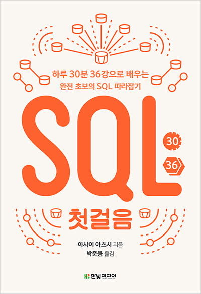

------
## 용어
- 데이터베이스 관리 시스템 (DBMS, Database Management System) : 저장장치에 저장된 데이터의 집합을 효율적으로 관리하기 위한 시스템
- DML (Data Manipulation Language) : 데이터베이스의 내용을 갱신하는 명령
- DDL (Data Definition Language) : 데이터베이스의 객체를 만들거나 삭제하는 명령
- DCL (Data Control Language) : 데이터를 제어(트랜잭션 및 접근권한)하는 명령
- 계층형 데이터베이스 : 폴더와 파일 등의 계층 구조로 데이터를 저장하는 데이터베이스
- 관계형 데이터베이스 : 표 형식으로 데이터를 저장하는 데이터베이스
- 객체지향 데이터베이스 : 객체 그대로를 데이터로 저장하는 데이터베이스
- XML 데이터베이스 : XML 형식으로 기록된 데이터를 저장하는 데이터베이스 XQuery라는 전용 명령어 사용
- 키 밸류 스토어(KVS) : 키와 그에 해당하는 값을 가지는 형태의 데이터를 저장하는 데이터베이스 NoSQL(Not only SQL)이라는 슬로건으로 생겨난 데이터베이스
- 데이터베이스 객체 : 테이블이나 뷰, 인덱스 등 데이터베이스 내에 정의하는 모든 것을 일컫는다.

## 데이터 검색
### 데이터 질의
```sql
SELECT * FROM 테이블명;
```
'애스터리스크(*)'는 모든 열을 의미.<br/>
예약어와 데이터베이스 객체명은 대소문자를 구별하지 않음.

### 테이블 구조 참조
```sql
DESC 테이블명;
```
DESC는 SQL명령이 아니다.

### 검색 조건 지정
```sql
SELECT 열1, 열2... FROM 테이블명 WHERE 조건식;
```
SELECT 구에서 표시하고자하는 열을 지정할 수 있다.<br/>
조건식은 열 연산자 상수로 이뤄진다.<br/>
```sql
SELECT * FROM sample21 WHERE no = 2;
```
문자열형의 상수는 싱클쿼트(' ')로 둘러싸 표기한다.
```sql
SELECT * FROM sample21 WHERE name = '홍길동';
```
날짜의 경우 싱글쿼트로 둘러싸 표기하고 연-원-일 과 같이 '하이픈(\-)'으로 구별한다.<br>
시간의 경우 싱글쿼트로 둘러싸고 시:분:초 와 같이 '콜론(:)'으로 구별한다.<br>
비교 연산자는 다음과 같다.
```sql
-- Equal
= 
-- Not Equal
<>
-- Greater 
> 
-- Greater Equal
>=
-- Lesser
<
-- Lesser Equal
<=
```
NULL은 'IS NULL', 'IS NOT NULL'을 사용하여 비교한다.
```sql
SELECT * FROM sample21 WHERE birthday IS NULL;
```

### 논리 연산
```sql
SELECT 열명 FROM 테이블명 WHERE 조건식1 AND 조건식2;
SELECT 열명 FROM 테이블명 WHERE 조건식1 OR 조건식2;
SELECT 열명 FROM 테이블명 WHERE NOT 조건식;
```
AND는 OR에 비해 우선 순위가 높다.

### 패턴 매칭에 의한 검색
```sql
SELECT 열명 FROM 테이블명 WHERE 열명 LIKE 패턴;
```
패턴을 정의할 때 사용할 수 있는 메타문자는 '%'와 '\_'가 있다.<br/>
'%' 는 임의의 문자열을 나타낸다.<br/>
'\_' 는 임의의 문자 하나를 나타낸다.<br/>
LIKE로 '%'를 검색하고 싶은 경우 역슬래시를 사용한다.
```sql
SELECT * FROM sample25 WHERE text LIKE '%\%%';
```
문자열 상수안에 '를 포함하고 싶을 경우 '를 2개 연속해서 기술한다.
```sql
SELECT * FROM sample25 WHERE text LIKE 'It''s';
```

## 정렬
### ORDER BY
```sql
SELECT 열명 FROM 테이블명 WHERE 조건식 ORDER BY 열명;
SELECT 열명 FROM 테이블명 WHERE 조건식 ORDER BY 열명 DESC;
SELECT 열명 FROM 테이블명 WHERE 조건식 ORDER BY 열명 ASC;
```
내림차순으로 정렬할 경우 'DESC (descendant)'를 사용한다.<br/>
오름차순으로 정렬할 경우 'ASC (ascendant)'를 사용한다.<br/>
정렬방법을 기술하지 않았을 경우 오름차순으로 정렬된다.<br/>
NULL 값의 경우 대소비교를 할 수 없어 별도의 방법으로 취급되는데 데이터베이스 제품에 따라 기준이 다르다.
> MySQL의 경우 NULL값을 가장 작은 값으로 취급한다.

### 복수의 열을 지정하여 정렬
```sql
SELECT 열명 FROM 테이블명 WHERE 조건식 ORDER BY 열명1 [ASC|DESC], 열명2 [ASC|DESC];
```

### 결과 행 제한
```sql
SELECT 열명 FROM 테이블명 WHERE 조건식  ORDER BY 열명 LIMIT 행수 [OFFSET 시작행(0 부터 시작)];
```
LIMIT는 표준 SQL이 아니다.
> SQL SERVER 에서는 TOP, Oracle에서는 ROWNUM을 사용해 유사한 일을 할 수 있다.

## 연산
### SELECT 구에서 연산
```sql
SELECT 식1, 식2... FROM 테이블명;
```
열 이름이 길고 알아보기 어려운 경우는 별명을 붙일 수 있다.
```sql
SELECT *, price * quantity AS amount FROM sample34;
```
키워드 AS는 생략할 수 있다.<br/>
이름에 ASCII 문자 이외의 것을 포함하는 경우에는 더블쿼트(" ")로 둘러싸서 지정해야 한다.<br/>
이름을 지정하는 경우 숫자로 시작되지 않도록 한다.

### WHERE 구에서 연산
```sql
SELECT 열명 FROM 테이블명 WHERE 식;
```
표준 SQL에서 내부 처리 순서가 딱히 정해져 있지 않지만 대부분의 데이터베이스가 'WHERE -> SELECT 순서'로 내부 처리를 하기 때문에 SELECT 구에서 지정한 별명을 WHERE 구 안에서 사용할 수 없다.

### NULL 값의 연산
NULL에 대한 연산의 결과는 모두 NULL이 된다.

### ORDER BY 구에서 연산
```sql
SELECT 열명 FROM 테이블명 WHERE 조건식 ORDER BY 식;
```
'ORDER BY' 는 가장 나중에 처리되므로 SELECT에서 지정한 별명을 사용할 수 있다.

### 함수
```sql
함수명( 인수1, 인수2... )
```
'ROUND, SIN, COS, SQRT LOG, SUM'등의 함수를 제공하여 연산자 대신 함수를 사용할 수 있다.
```sql
SELECT amount, ROUND(amount) FROM sample341;
```

### 문자열 연산
```sql
-- 문자열 결합
CONCAT
-- 일부 문자열 추출
SUBSTRING
-- 앞뒤 공백 제거
TRIM
-- 문자열 길이
CHARACTER_LENGTH
```

### 날짜 연산
```sql
-- 현재 시스템 날짜와 시간
CURRENT_TIMESTAMP
-- 현재 시스템 날짜
CURRENT_DATE
-- 기간형 상수
INTERVAL
-- 날짜형 간 뺄셈
DATEDIFF
```

### CASE 문
```sql
CASE WHEN 조건식1 THEN 식1
    [WHEN 조건식2 THEN 식2]
    [ELSE 식3]
END;
```
'CASE'문을 사용해서 NULL 값을 0으로 변환할 수 있다.
```sql
SELECT a, CASE WHEN a IS NULL THEN 0
ELSE a
END "a(null=0)" FROM sample27;
```
NULL 값을 변환하는 경우에는 'COALESCE' 함수를 사용하는 방법도 있다.
```sql
SELECT a, COALESCE(a, 0) FROM sample37;
```
COALESCE 함수는 NULL이 아닌 값에 대해서 첫번째 인수의 값을 반환하고 그렇지 않으면 두번째 인수의 값을 반환한다.<br/>
단순 CASE문을 사용하면 조건식을 사용하지 않고 CASE문을 작성할 수 있다.
```sql
CASE 식1
    [WHEN 식2 THEN 식3]
    [WHEN 식4 THEN 식5]
    [ELSE 식6]
END;

SELECT a AS "코드"
CASE a
    WHEN 1 THEN '남자'
    WHEN 2 THEN '여자'
    ELSE '미지정'
END AS "성별" FROM sample37
```
ELSE를 생략하면 ELSE NULL이 된다. 즉 ELSE를 생략하면 상정하지 않은 데이터가 들어왔을 때 NULL이 반환된다. 따라서 ELSE를 생략하지 않고 지정하는 편이 낫다.<br/>
WHEN에서 NULL을 비교하기 위해서는 IS NULL을 사용해야하므로 단순 CASE문은 NULL값을 비교할 수 없다.

## 데이터 변경
### 데이터 추가
```sql
INSERT INTO 테이블명 VALUES(값1, 값2...);
```
값을 저장할 열을 지정할 수 있다.
```sql
INSERT INTO 테이블명(열1, 열2...) VALUES(값1, 값2);
```
별도의 값을 지정하지 않은 열은 기본값이 저장된다. 명시적으로 기본값을 넣으려면 DEFAULT 예약어를 사용하면 된다.
```sql
INSERT INTO sample411(no, d) VALUES(2, DEFAULT);
```

### 데이터 삭제
```sql
DELETE FROM 테이블명 WHERE 조건식;
```
데이터의 삭제 방식에는 물리삭제와 논리삭제가 있다.
- 물리삭제 : DELETE 명령을 사용해서 실제로 행을 삭제.
- 논리삭제 : 삭제 플래그를 이용하여 데이터가 삭제된 것처럼 가장.

### 데이터 갱신
```sql
UPDATE 테이블명 SET 열1 = 값1, 열2 = 값2... WHERE 조건식;
```
여러 열의 데이터를 갱신할 경우 SET 구의 실행 순서에 유의해야 한다. 실행순서는 데이터베이스 제품에 따라 그 처리방식이 다른데 MySQL은 좌측에서 순서대로 Oracle은 기술한 순서가 처리에 영향을 주지 않는다.

## 집계
### 행 개수 구하기
```sql
COUNT(집합)
```
'COUNT' 집계함수로 행 개수를 구할 수 있다.<br/>
COUNT 집계함수는 집합 안에 NULL 값이 있을 경우 이를 제외하고 처리한다.

### 중복제거
집합안에 중복된 값이 있을 수 있는데 'DISTINCT' 키워드를 통해서 중복 값을 제거할 수 있다.
```sql
-- 중복 포함(기본 설정)
SELECT ALL name FROM sample51;
-- 중복 제거
SELECT DISTINCT name FROM sample51;
```

### 집계함수에서 중복제거
```sql
COUNT([ALL|DISTINCT] 집합)
```

### COUNT 이외의 집계함수
```sql
SUM([ALL|DISTINCT] 집합)
AVG([ALL|DISTINCT] 집합)
MIN([ALL|DISTINCT] 집합)
MAX([ALL|DISTINCT] 집합)
```
집계함수는 기본적으로 NULL을 무시하므로 NULL을 포함하고자 한다면 CASE문 혹은 COALESCE 함수를 통해서 NULL을 0으로 변경하여 처리해야 한다.

### 그룹화
```sql
SELECT 열명 FROM 테이블명 GROUP BY 열1, 열2;
```
'GROUP BY' 구는 지정한 열의 값이 같은 행이 하나의 그룹으로 묶인다.<br/>
집계함수는 WHERE 구의 조건식에서 사용할 수 없다. GROUP BY의 내부 처리 순서가 WHERE 보다 뒤이기 때문이다.<br/>
집계한 결과에서 조건에 맞는 값을 걸러내려면 'HAVING' 구를 사용해야 한다.
```sql
SELECT name, COUNT(name) FROM sample51 GROUP BY name HAVING COUNT(name) = 1;
```
HAVING 구를 포함한 내부처리 순서는 다음과 같다.
> WHERE -> GROUP BY -> HAVING -> SELECT -> ORDER BY

GROUP BY를 사용할 때 주의점이 있는데 GROUP BY에 직접 지정한 열을 제외한 열을 집계함수를 사용하지 않은 채 SELECT 구에 기술해서는 안된다.
```sql
-- no, quantity는 지정할 수 없다.
SELECT no, name, quantity FROM sample51 GROUP BY name;
```
GROUP BY로 그룹화하면 반환되는 결과는 그룹당 하나의 행이어야 하는데 GROUP BY에 지정하지 않은 열은 복수의 행을 가질 수 있기 때문이다. 이경우 집계함수를 사용하여 하나의 행으로 만들어 주면 SELECT 구에서 사용할 수 있다.

### 서브쿼리
```sql
(SELECT 명령)
```
서브쿼리는 SQL명령문 안에 하위 명령을 괄호로 묶어 지정하는 방법이다.<br/>
서브쿼리는 다음과 같은 방식으로 사용할 수 있다.
- DELETE WHERE 구에서 서브쿼리 사용
```sql
-- 데이터를 추가하거나 갱신할 경우 동일한 테이블을 서브쿼리에서 사용할 수 없도록 되어 있기 때문에 인라인 뷰로 임시 테이블을 만들어야한다.
DELETE FROM sample54 WHERE a = (SELECT a FROM (SELECT MIN(a) AS a FROM sample54) AS x);
```
- SELECT 구에서 사용
```sql
SELECT
    (SELECT COUNT(*) FROM sample51) AS sq1,
    (SELECT COUNT(*) FROM sample54) AS sq2;
```
- SET 구에서 사용
```sql
UPDATE sample54 SET a = (SELECT MAX(a) FROM sample54);
```
- FROM 구에서 사용
```sql
SELECT * FROM (SELECT * FROM sample54) AS sq;
```
- INSERT 명령에서 사용
```sql
INSERT INTO sample541 VALUES(
    (SELECT COUNT(*) FROM sample51),
    (SELECT count(*) FROM sample54)
);
```
- 클라이언트 변수로 서브쿼리 사용
```sql
set @a = (SELECT MIN(a) FROM sample54);
DELETE FROM sammple54 WHERE a = @a;
```
- SELECT 결과를 INSERT
```sql
-- SELECT 결과 1, 2가 반환되고 INSERT 할 테이블의 열수와 자료형이 일치하면 삽입된다.
-- INSERT SELECT 명령이라고 한다.
INSERT INTO sample541 SELECT 1, 2;
-- 테이블의 행 복사
INSERT INTO sample542 SELECT * FROM sample543;
```

### 상관 서브쿼리
서브 쿼리를 사용해 검색할 때 데이터가 존재하는지 여부를 지정할 수 있다. 이런 경우 'EXISTS'를 사용해 조사할 수 있다.
```sql
SELECT sample551 SET a = '있음' WHERE
EXISTS (SELECT * FROM sample552 WHERE no2 = no);
```
데이터가 존재하지 않는지를 알고 싶을 경우 'NOT EXISTS'를 사용할 수 있다.
```sql
SELECT sample551 SET a = '없음' WHERE
NOT EXISTS (SELECT * FROM sample552 WHERE no2 = no);
```
상관 서브쿼리는 EXISTS를 사용한 예제와 같이 부모 명령과 서브쿼리가 특정 관계를 맺는 서브쿼리를 말한다.<br/>
단순한 서브쿼리는 부모와 아무 관계도 없기 때문에 단독 쿼리로 실행될 수 있다.<br/>
상관 서브쿼리는 부모 명령과 연관되어 처리되므로 단독으로 실행시킬 수 없다.<br/>
테이블의 열이름이 같다면 다음과 같이 테이블 명을 적어주어 모호함을 해결할 수 있다.
```sql
UPDATE sample551 SET a = '있음' WHERE
EXISTS (SELECT * FROM sample552 WHERE sample522.no2 = sample551.no);
```

### IN
스칼라 값끼리 비교할 때는 = 연산자를 사용한다.<br/>
집합의 경우 = 연산자를 사용할 수 없고 IN을 사용해서 집합안에 값이 존재하는지를 조사할 수 있다.<br/>
```sql
열명 IN(집합)
```
```sql
-- 3이나 5가 있는 행을 출력
SELECT * FROM sample551 WHERE no IN(3, 5);
```
IN은 집합 안에 NULL값을 무시하지 않는다. 다만 NULL = NULL을 제대로 계산할 수 없으므로 IS NULL을 사용해야 한다.

## 데이터베이스 객체 변경
### 테이블 작성
```sql
CREATE TABLE 테이블명 (열 정의1, 열정의 2);
-- 열정의
열명 자료형 [DEFAULT 기본값] [NULL|NOT NULL] [UNIQUE]
```

### 테이블 삭제
```sql
DROP TABLE 테이블명;
-- 데이터의 모든 행 삭제
DELETE FROM 테이블명;
-- 데이터의 모든 행 삭제( 빠른 속도로 삭제 가능 )
TRUNCATE TABLE 테이블명;
``` 

### 테이블 변경
```sql
ALTER TABLE 테이블명 변경명령;
```
- 열 추가
```sql
ALTER TABLE 테이블명 ADD 열 정의;
```
NOT NULL 제약이 걸린 열을 추가할 때는 기본값을 지정해야 한다.
- 열 속성 변경
```sql
ALTER TABLE 테이블명 MODIFY 열 정의;
```
- 열 이름 변경
```sql
ALTER TABLE 테이블명 CHANGE [기존 열 이름] [신규 열 이름];
```
- 열 삭제
```sql
ALTER TABLE 테이블명 DROP 열명;
```

### 제약
제약은 열과 테이블에 설정할 수 있다.
- 열 제약 : 열 하나에 한개의 제약을 설정하는 경우
```sql
CREATE TABLE sample631 (
    a INTEGER NOT NULL,
    b INTEGER NOT NULL UNIQUE,
    c VARCHAR(30)
);
```
- 테이블 제약 : 한개의 제약으로 복수의 열에 설정하는 경우
```sql
CREATE TABLE sample632 (
    no INTEGER NOT NULL,
    sub_no INTEGER NOT NULL,
    name VARCHAR(30),
    PRIMARY KEY(no, sub_no)
);
```
제약에는 이름을 붙일 수 있다. 이름은 'CONSTRAINT' 키워드를 사용해서 붙인다.
```sql
CREATE TABLE sample632 (
    no INTEGER NOT NULL,
    sub_no INTEGER NOT NULL,
    name VARCHAR(30),
    CONSTRAINT pkey_sample PRIMARY KEY(no, sub_no)
);
```
기존 테이블에도 나중에 제약을 추가할 수 있다.
- 열 제약 추가
```sql
ALTER TABLE sample631 MODIFY c VARCHAR(no) NOT NULL;
```
- 테이블 제약 추가
```sql
ALTER TABLE sample631 ADD CONSTRAINT pkey_sample631 PRIMARY KEY(a);
```
제약의 삭제도 가능하다.
- 열 제약 삭제
```sql
ALTER TABLE sample631 MODIFY c VARCHAR(30);
```
- 테이블 제약 삭제
```sql
ALTER TABLE sample631 DROP CONSTRAINT pkey_sample631;
-- 기본키는 테이블당 하나만 설정할 수 있으므로 제약명 없이도 삭제할 수 있다.
ALTER TABLE sample631 DROP PRIMARY KEY;
```

### 인덱스
- 인덱스 작성
```sql
CREATE INDEX 인덱스명 ON 테이블명 (열명1, 열명2...);
```

- 인덱스 삭제
```sql
DROP INDEX 인덱스명 ON 테이블명;
```
인덱스를 작성해두면 검색이 빨라진다.<br/>
반면 삽입시 인덱스를 최신 상태로 갱신하는 처리가 늘어나므로 처리속도가 조금 떨어진다.<br/>
또 인덱스로 설정되지 않은 열을 WHERE 조건식에 사용하는 경우 인덱스를 사용 할 수 없어 성능상 이득이 없다.<br/>
실제로 인덱스를 사용해 검색하는지를 확인하려면 'EXPLAIN' 명령을 사용하면 된다.
```sql
EXPLAIN SQL 명령;
```
EXPLAIN 명령은 표준 SQL에 존재하지 않는 데이터베이스 의존형 명령이다.

### 뷰
뷰는 테이블과 같은 부류의 데이터베이스 객체 중 하나다.<br/>
데이터베이스 객체로 등록할 수 없는 SELECT 명령을 객체로서 이름 붙여 관리할 수 있도록 한것이 뷰이다.<br/>
뷰는 테이블처럼 취급할 수 있지만 실체가 존재하지 않는다라는 의미로 '가상 테이블'이라 불리기도 한다.
- 뷰 작성
```sql
CREATE VIEW 뷰명 AS SELECT 명령;
-- CREATE VIEW에서 열 지정
-- 열 지정을 생략한 경우에는 SELECT 명령의 SELECT 구에서 지정하는 열정보가 수집된다.
CREATE VIEW 뷰명 (열명1, 열명2...) AS SELECT 명령;
```
- 뷰 삭제
```sql
DROP VIEW 뷰명;
```
뷰는 데이터베이스 객체로서 저장장치에 저장된다. 하지만 테이블과 달리 대량의 저장공간을 필요로 하지 않는다.<br/>
데이터베이스에 저장되는 것은 SELECT 명령 뿐이다. 저장공간을 소비하지 않는 대신 CPU자원을 사용한다.<br/>
뷰의 근원이 되는 테이블에 보관하는 데이터양이 많은 경우 집계처리를 할 때도 뷰가 사용된다면 처리속도가 많이 떨어진다.<br/>
'머티리얼라이즈드 뷰(Materialized View)'는 뷰가 처음 참조되었을 때 데이터를 저장장치에 저장하여 재사용한다.<br/>
뷰를 구성하는 SELECT 명령은 단독으로 실행할 수 있어야 한다. 부모 쿼리와 어떻게든 연관되어 있다면 사용할 수 없다. 이와 같은 뷰의 약점은 '함수 테이블'을 사용하여 회피할 수 있다.


## 테이블 결합
### UNION으로 합집합 구하기
```sql
SELECT 명령
UNION
SELECT 명령;
```
UNION으로 합집합을 구하는 경우 ORDER BY 명령은 마지막 SELECT 명령에만 지정해야 한다.
```sql
-- 다음 쿼리는 오류다.
SELECT a FROM sample71_a ORDER BY a
UNION
SELECT b FROM sample71_b;
-- 다음 쿼리는 정상이다.
SELECT a AS c FROM sample71_a
UNION
SELECT b AS c FROM sample71_b ORDER BY c; -- 별명을 지어서 이름을 일치시켜야한다.
```
UNION은 기본적으로 중복값을 제거한 결과를 반환한다. 중복값을 포함하려면 'UNION ALL'을 사용해야 한다.
```sql
SELECT 명령
UNION ALL
SELECT 명령
```
'UNION DISTINCT' 라는 문법은 허용하지 않는다.

### 교차결합
데이터베이스의 테이블은 집합이다. SELECT 명령에서 FROM 구에 복수의 테이블을 지정하면 이들은 곱집합으로 계산된다.
```sql
SELECT * FROM 테이블명1, 테이블명2...;
```
교차결합은 UNION과 달리 열방향으로 확대된다.

### 내부결합
내부결합(Inner Join)은 교차결합으로 계산된 곱집합에서 원하는 조합을 검색하는 것이다.<br/>
```sql
SELECT 상품.상품명, 재고수.재고수 FROM 상품, 재고수
WHERE 상품.상품코드 = 재고수.상품코드
AND 상품.상품분류 = '식료품';
```
'INNER JOIN' 키워드를 사용하면 위와 같은 내부결합을 할 수 있다.
```sql
SELECT 상품.상품명, 재고수.재고수 
FROM 상품 INNER JOIN 재고수
ON 상품.상품코드 = 재고수.상품코드
WHERE 상품.상품분류 = '식료품';
```

### 외부결합
내부 결합은 두 테이블 모두에서 일치하는 행을 리턴한다.<br/>
외부 결합은 두 테이블 모두에서 일치하지 않는 행도 리턴한다.
```sql
SELECT 상품.상품명, 재고수.재고수 
FROM 상품 LEFT JOIN 재고수
ON 상품.상품코드 = 재고수.상품코드
WHERE 상품.상품분류 = '식료품';
```
'LEFT JOIN', 'RIGHT JOIN'으로 외부결합을 할 수 있다.

## 트랜잭션
```sql
-- 트랜잭션 시작
START TRANSACTION
-- 또는
BEGIN TRANSACTION
-- 커밋
COMMIT
-- 롤백
ROLLBACK
```